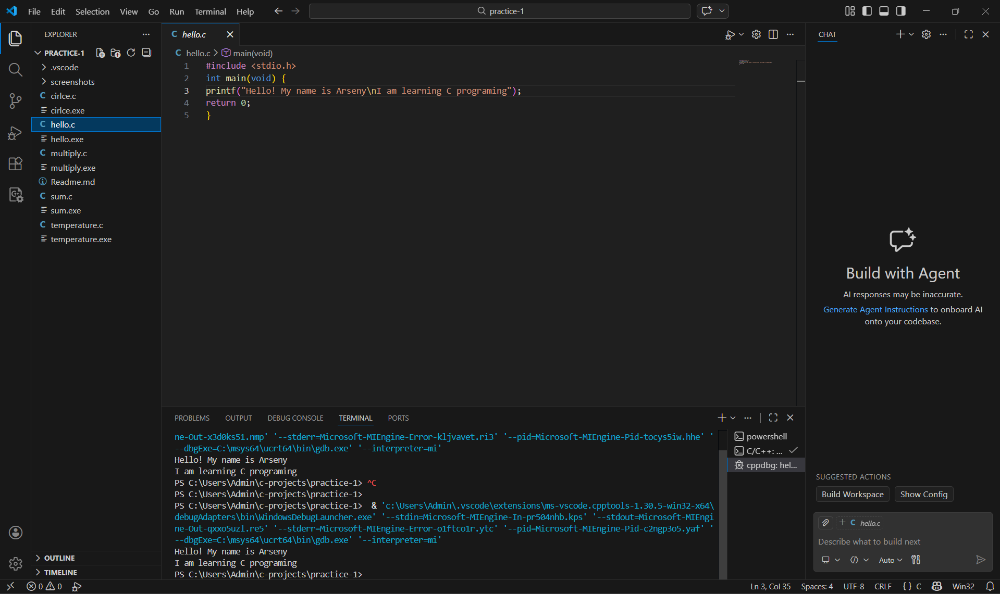
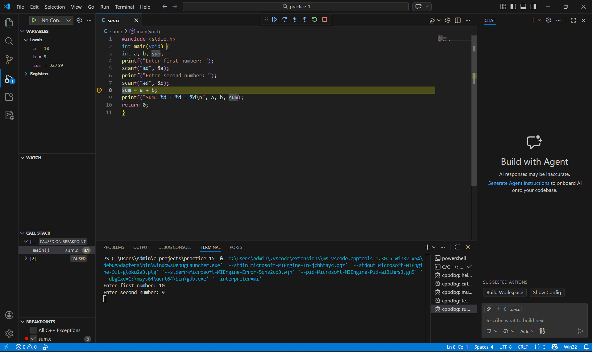
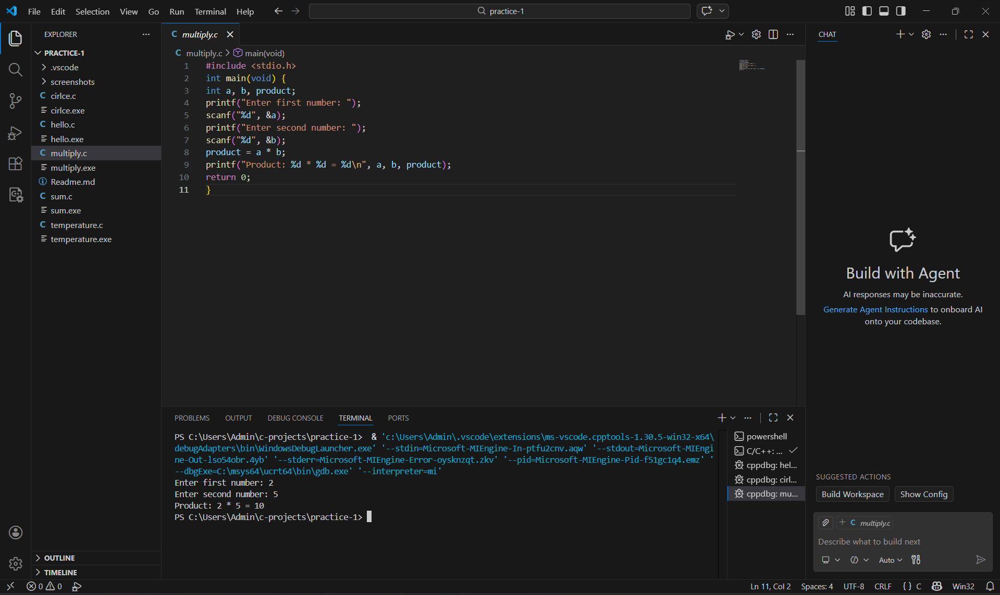
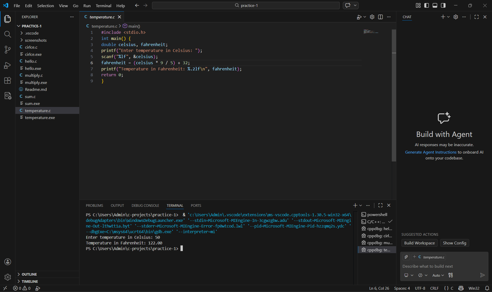
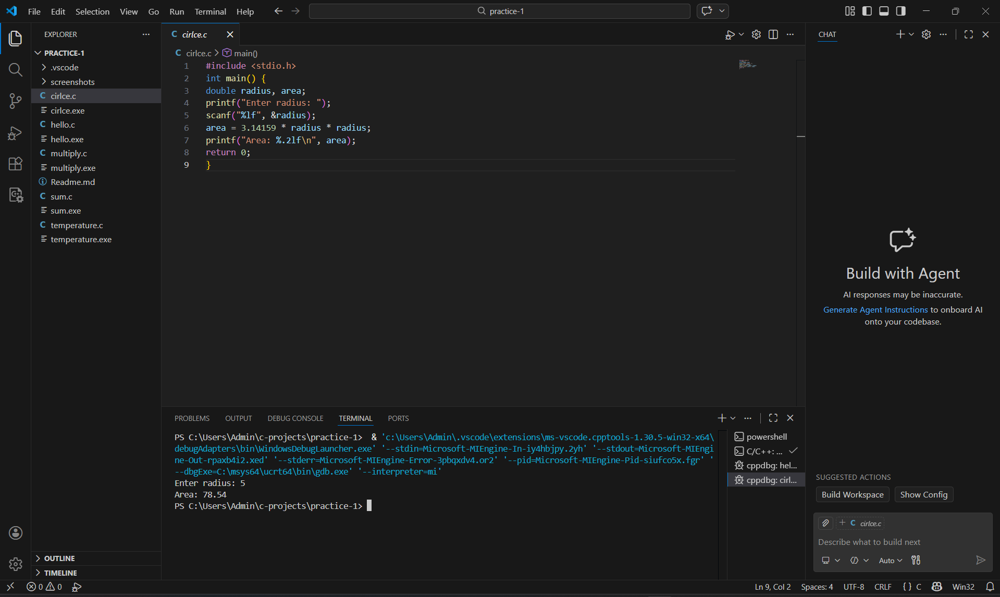

# Практическая работа 1: Установка среды и первые программы
**Студент:** Карасев Арсений Алексеевич
**Группа:** 1зб_ИВТ-25
**Дата:** 15 февраля 2026 г.
---
## Задание 1.1: Hello, World!
### Постановка задачи
Напишите программу, которая выводит на экран сообщение "Hello, World!".
### Список идентификаторов
| Имя | Тип | Описание |
|-----|-----|----------|
| — | — | Переменные не используются |
### Код программы
```c
#include <stdio.h>
int main(void) {
printf("Hello, World!\n");
return 0;
}
```
### Результаты работы

---
## Задание 1.2: Площадь круга
### Постановка задачи
Напишите программу, которая запрашивает радиус круга и вычисляет его площадь.
### Математическая модель
$$
S = \pi r^2
$$
### Список идентификаторов
| Имя | Тип | Описание |
|-----|-----|----------|
| `radius` | `double` | Радиус круга (ввод пользователя) |
| `area` | `double` | Вычисленная площадь |
### Код программы
```c
#include <stdio.h>
#define PI 3.14159265358979
int main(void) {
double radius, area;
printf("Введите радиус: ");
scanf("%lf", &radius);
area = PI * radius * radius;
printf("Площадь круга: %.2lf\n", area);
return 0;
}
```
### Результаты работы

Задание 1.3: Программа multiply.c
Постановка задачи
Напишите программу, которая запрашивает у пользователя два целых числа, вычисляет их произведение и выводит результат.

Список идентификаторов
Имя	Тип	Описание
a	int	Первое введённое число
b	int	Второе введённое число
product	int	Произведение чисел a и b
Код программы
#include <stdio.h>

int main(void) {
    int a, b, product;
    
    printf("Enter first number: ");
    scanf("%d", &a);
    
    printf("Enter second number: ");
    scanf("%d", &b);
    
    product = a * b;
    printf("Product: %d * %d = %d\n", a, b, product);
    
    return 0;
}
Результаты работы

Задание 1.5: Программа temperature.c
Постановка задачи
Напишите программу для перевода температуры из градусов Цельсия в градусы Фаренгейта.

Математическая модель
Перевод температуры выполняется по формуле:
    9
F =   С + 32
​    5
где:

$C$ — температура в градусах Цельсия

$F$ — температура в градусах Фаренгейта

Список идентификаторов
Имя	Тип	Описание
celsius	double	Температура в градусах Цельсия
fahrenheit	double	Температура в градусах Фаренгейта

Код программы
#include <stdio.h>

int main() {
    double celsius, fahrenheit;
    
    printf("Enter temperature in Celsius: ");
    scanf("%lf", &celsius);
    
    fahrenheit = (celsius * 9 / 5) + 32;
    printf("Temperature in Fahrenheit: %.2lf\n", fahrenheit);
    
    return 0;
}
Результаты работы


Задание 1.4: Программа circle.c
Постановка задачи
Напишите программу для вычисления площади круга по заданному радиусу.

Математическая модель
Площадь круга вычисляется по формуле:

S = πr2
где:

$r$ — радиус круга

$\pi \approx 3.14159$

Список идентификаторов
Имя	Тип	Описание
radius	double	Радиус круга (ввод пользователя)
area	double	Вычисленная площадь круга
Код программы
#include <stdio.h>

int main() {
    double radius, area;
    
    printf("Enter radius: ");
    scanf("%lf", &radius);
    
    area = 3.14159 * radius * radius;
    printf("Area: %.2lf\n", area);
    
    return 0;
}
Результаты работы
