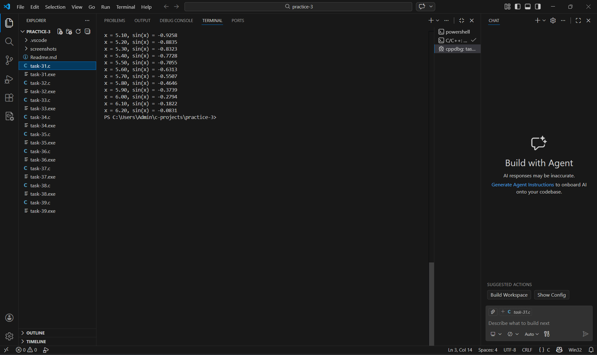
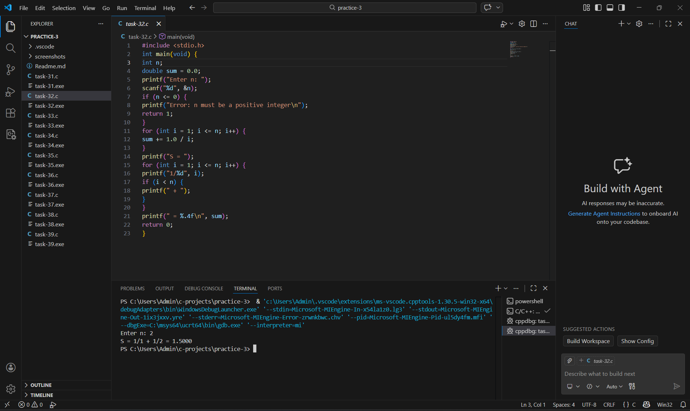
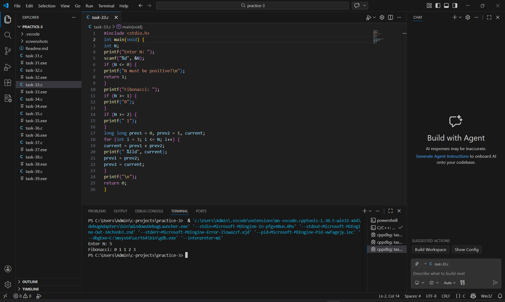
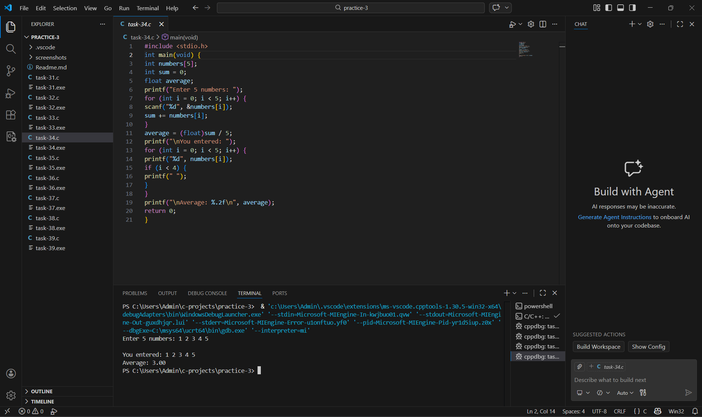
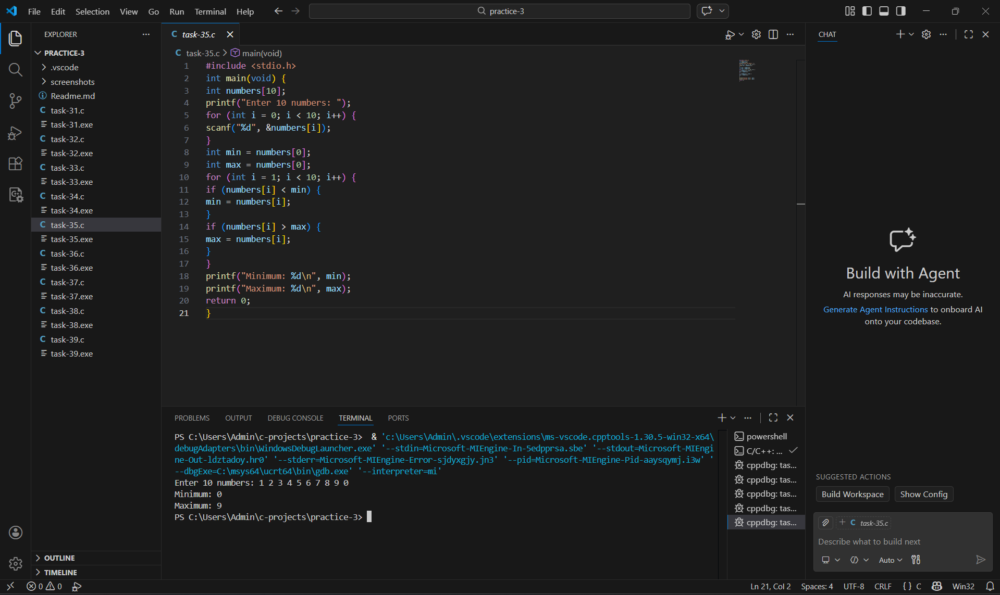
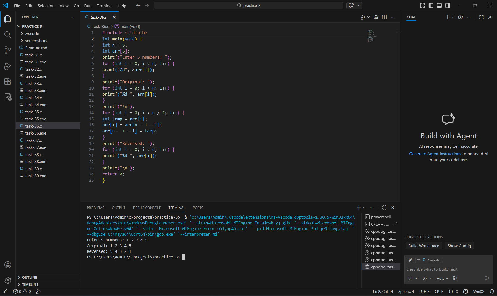
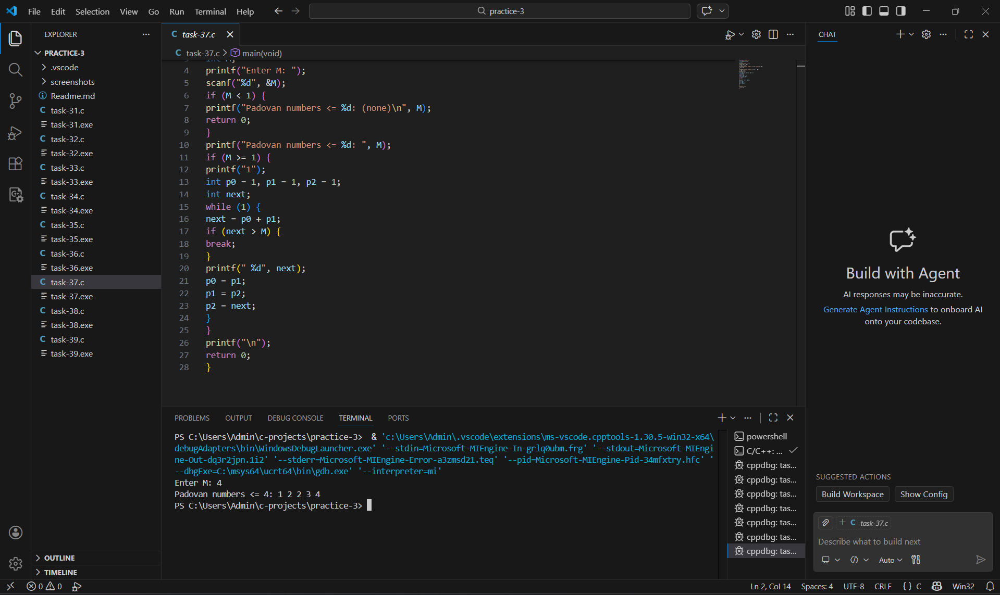
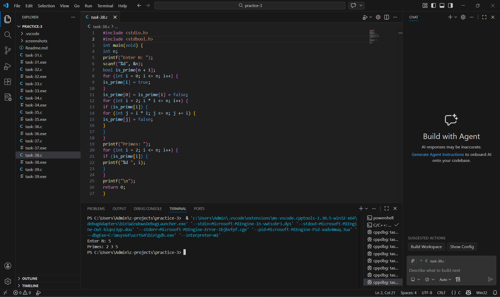
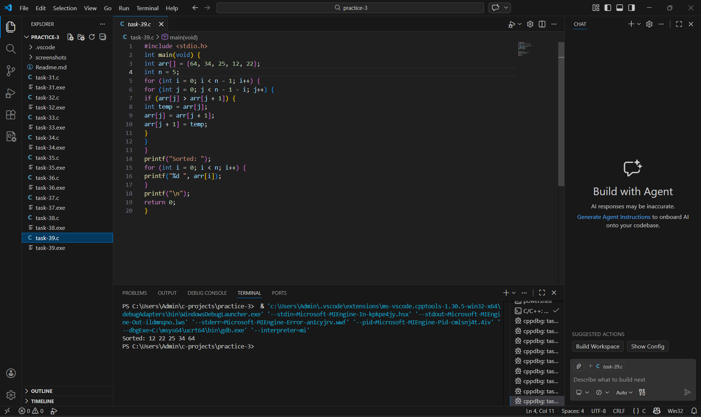

Практическая работа 3: Циклы и массивы
Студент: Карасев Арсений Алексеевич
Группа: 1зб_ИВТ-25
Дата: 15 февраля 2026 г.

Задание 3.1: Таблица синусов
Постановка задачи
Напишите программу, которая выводит таблицу значений sin(x) от 0 до 2π с шагом 0.1.

Формат вывода:
x = 0.00, sin(x) = 0.0000
x = 0.10, sin(x) = 0.0998
x = 0.20, sin(x) = 0.1987
...
Математическая модель
Значения синуса вычисляются с помощью функции sin(x) из библиотеки math.h. Угол x задаётся в радианах. Полный период синуса составляет 2π ≈ 6.28318 радиан.

Список идентификаторов
Имя	Тип	Описание
pi	double	Число π (3.14159)
end	double	Верхняя граница (2π)
x	double	Текущее значение аргумента
rounded_x	double	Округлённое значение x для вывода
Код программы
#include <stdio.h>
#include <math.h>

int main(void) {
    double pi = 3.14159;
    double end = 2 * pi;
    
    printf("Table of sin(x) from 0 to 2π (2*3.14159 ≈ %.5f)\n", end);
    printf("================================================\n");
    
    for (double x = 0; x <= end + 0.001; x += 0.1) {
        double rounded_x = round(x * 100) / 100;
        printf("x = %.2f, sin(x) = %.4f\n", rounded_x, sin(x));
    }
    
    return 0;
}
Результаты работы

Задание 3.2: Сумма гармонического ряда
Постановка задачи
Вычислите сумму гармонического ряда:

S=1+ 2  + 3 + .. + n
     1    1        1
​
​
Математическая модель
Гармонический ряд — сумма обратных величин натуральных чисел. При увеличении n сумма растёт логарифмически.

Список идентификаторов
Имя	Тип	Описание
n	int	Количество членов ряда
sum	double	Сумма ряда
Код программы
#include <stdio.h>

int main(void) {
    int n;
    double sum = 0.0;
    
    printf("Enter n: ");
    scanf("%d", &n);
    
    if (n <= 0) {
        printf("Error: n must be a positive integer\n");
        return 1;
    }
    
    for (int i = 1; i <= n; i++) {
        sum += 1.0 / i;
    }
    
    printf("S = ");
    for (int i = 1; i <= n; i++) {
        printf("1/%d", i);
        if (i < n) {
            printf(" + ");
        }
    }
    printf(" = %.4f\n", sum);
    
    return 0;
}
Результаты работы

Задание 3.3: Числа Фибоначчи
Постановка задачи
Выведите первые N чисел Фибоначчи.

Правило: F(0) = 0, F(1) = 1, F(n) = F(n-1) + F(n-2)

Математическая модель
Последовательность Фибоначчи задаётся рекуррентным соотношением. Каждое следующее число равно сумме двух предыдущих.

Список идентификаторов
Имя	Тип	Описание
N	int	Количество чисел для вывода
prev1	long long	Предпредыдущее число (F(n-2))
prev2	long long	Предыдущее число (F(n-1))
current	long long	Текущее число Фибоначчи
Код программы
#include <stdio.h>

int main(void) {
    int N;
    
    printf("Enter N: ");
    scanf("%d", &N);    
    
    if (N <= 0) {
        printf("N must be positive!\n");
        return 1;
    }
    
    printf("Fibonacci: ");    
    
    if (N >= 1) {
        printf("0");
    }
    if (N >= 2) {
        printf(" 1");
    }
    
    long long prev1 = 0, prev2 = 1, current;
    
    for (int i = 3; i <= N; i++) {
        current = prev1 + prev2;
        printf(" %lld", current);
        prev1 = prev2;
        prev2 = current;
    }    
    
    printf("\n");   
    
    return 0;
}
Результаты работы

Задание 3.4: Среднее арифметическое
Постановка задачи
Напишите программу, которая:

Запрашивает 5 чисел с клавиатуры

Сохраняет их в массив

Вычисляет и выводит среднее арифметическое

Список идентификаторов
Имя	Тип	Описание
numbers[5]	int[]	Массив из 5 целых чисел
sum	int	Сумма элементов массива
average	float	Среднее арифметическое
Код программы
#include <stdio.h>

int main(void) {
    int numbers[5];
    int sum = 0;
    float average;
    
    printf("Enter 5 numbers: ");
    for (int i = 0; i < 5; i++) {
        scanf("%d", &numbers[i]);
        sum += numbers[i];
    }
    
    average = (float)sum / 5;
    
    printf("\nYou entered: ");
    for (int i = 0; i < 5; i++) {
        printf("%d", numbers[i]);
        if (i < 4) {
            printf(" ");
        }
    }
    
    printf("\nAverage: %.2f\n", average);    
    
    return 0;
}

Результаты работы

Задание 3.5: Минимум и максимум
Постановка задачи
Напишите программу, которая находит минимальный и максимальный элементы массива из 10 чисел, введённых с клавиатуры.

Список идентификаторов
Имя	Тип	Описание
numbers[10]	int[]	Массив из 10 целых чисел
min	int	Минимальный элемент
max	int	Максимальный элемент
Код программы
#include <stdio.h>

int main(void) {
    int numbers[10];
    
    printf("Enter 10 numbers: ");
    for (int i = 0; i < 10; i++) {
        scanf("%d", &numbers[i]);
    }
    
    int min = numbers[0];
    int max = numbers[0];
    
    for (int i = 1; i < 10; i++) {
        if (numbers[i] < min) {
            min = numbers[i];
        }
        if (numbers[i] > max) {
            max = numbers[i];
        }
    }
    
    printf("Minimum: %d\n", min);
    printf("Maximum: %d\n", max);
    
    return 0;
}

Результаты работы

Задание 3.6: Реверс массива
Постановка задачи
Напишите программу, которая переворачивает массив "на месте" (без создания нового массива).

Математическая модель
Алгоритм реверса: менять местами элементы с начала и конца, двигаясь к середине:

Обменять arr[0] и arr[n-1]

Обменять arr[1] и arr[n-2]

И так далее до середины массива

Список идентификаторов
Имя	Тип	Описание
arr[5]	int[]	Исходный массив
n	int	Размер массива (5)
temp	int	Временная переменная для обмена

Код программы

#include <stdio.h>

int main(void) {
    int n = 5;
    int arr[5];
    
    printf("Enter 5 numbers: ");
    for (int i = 0; i < n; i++) {
        scanf("%d", &arr[i]);
    }
    
    printf("Original: ");
    for (int i = 0; i < n; i++) {
        printf("%d ", arr[i]);
    }
    printf("\n");
    
    for (int i = 0; i < n / 2; i++) {
        int temp = arr[i];
        arr[i] = arr[n - 1 - i];
        arr[n - 1 - i] = temp;
    }
    
    printf("Reversed: ");
    for (int i = 0; i < n; i++) {
        printf("%d ", arr[i]);
    }
    printf("\n");
    
    return 0;
}

Результаты работы

Задание 3.7: Числа Падована
Постановка задачи
Числа Падована определяются формулой:

P(0) = P(1) = P(2) = 1

P(n) = P(n-2) + P(n-3) для n ≥ 3

Последовательность: 1, 1, 1, 2, 2, 3, 4, 5, 7, 9, 12, 16, 21, …

Выведите все числа Падована, не превосходящие введённое число M.

Математическая модель
Числа Падована похожи на числа Фибоначчи, но используют другую рекуррентную формулу: каждое следующее число равно сумме предпредыдущего и предпредпредыдущего.

Список идентификаторов
Имя	Тип	Описание
M	int	Верхняя граница
p0, p1, p2	int	Три последних числа Падована
next	int	Следующее число Падована
Код программы
#include <stdio.h>

int main(void) {
    int M;
    
    printf("Enter M: ");
    scanf("%d", &M);
    
    if (M < 1) {
        printf("Padovan numbers <= %d: (none)\n", M);
        return 0;
    }
    
    printf("Padovan numbers <= %d: ", M);
    
    if (M >= 1) {
        printf("1");
        
        int p0 = 1, p1 = 1, p2 = 1;
        int next;
        
        while (1) {
            next = p0 + p1;
            
            if (next > M) {
                break;
            }
            
            printf(" %d", next);
            
            p0 = p1;
            p1 = p2;
            p2 = next;
        }
    }
    
    printf("\n");
    
    return 0;
}

Результаты работы
 

Задание 3.8: Решето Эратосфена
Постановка задачи
Найдите все простые числа, не превосходящие заданное N, с помощью алгоритма "Решето Эратосфена".

Математическая модель
Алгоритм решета Эратосфена:

Создаём массив булевых значений для чисел от 0 до N

Изначально считаем все числа простыми

0 и 1 не являются простыми

Для каждого числа i от 2 до √N:

Если i простое, вычёркиваем все кратные i (начиная с i²)

Список идентификаторов
Имя	Тип	Описание
n	int	Верхняя граница поиска
is_prime	bool[]	Массив флагов "простое/составное"
i, j	int	Счётчики циклов
Код программы
#include <stdio.h>
#include <stdbool.h>

int main(void) {
    int n;
    
    printf("Enter N: ");
    scanf("%d", &n);
    
    bool is_prime[n + 1];
    
    for (int i = 0; i <= n; i++) {
        is_prime[i] = true;
    }
    
    is_prime[0] = is_prime[1] = false; 
    
    for (int i = 2; i * i <= n; i++) { 
        if (is_prime[i]) {
            for (int j = i * i; j <= n; j += i) {
                is_prime[j] = false;
            }
        }
    }
    
    printf("Primes: ");
    for (int i = 2; i <= n; i++) {
        if (is_prime[i]) {
            printf("%d ", i);
        }
    }
    printf("\n");
    
    return 0;
}

Результаты работы
 

Задание 3.9: Сортировка пузырьком
Постановка задачи
Отсортируйте массив по возрастанию методом пузырька.

Математическая модель
Алгоритм сортировки пузырьком:

Проходим по массиву, сравнивая соседние элементы

Если левый больше правого, меняем их местами

После каждого прохода наибольший элемент "всплывает" в конец

Повторяем, пока массив не будет отсортирован

Список идентификаторов
Имя	Тип	Описание
arr[]	int[]	Исходный массив
n	int	Размер массива (5)
i, j	int	Счётчики циклов
temp	int	Временная переменная для обмена
Код программы
#include <stdio.h>

int main(void) {
    int arr[] = {64, 34, 25, 12, 22};
    int n = 5;
    
    for (int i = 0; i < n - 1; i++) {
        for (int j = 0; j < n - 1 - i; j++) {
            if (arr[j] > arr[j + 1]) {
                int temp = arr[j];
                arr[j] = arr[j + 1];
                arr[j + 1] = temp;
            }
        }
    }
    
    printf("Sorted: ");
    for (int i = 0; i < n; i++) {
        printf("%d ", arr[i]);
    }
    printf("\n");
    
    return 0;
}
Результаты работы

 
