Практическая работа 4: Функции и указатели
Студент: Карасев Арсений Алексеевич
Группа: 1зб_ИВТ-25
Дата: 16 февраля 2026 г.

Часть А: Упражнения с указателями
Задание А.1: Адрес и значение
Постановка задачи
Объявите переменную int x = 42; и указатель int *p на неё. Выведите:

Значение x

Адрес x (используя &x)

Значение указателя p (адрес, который он хранит)

Значение по адресу p (используя *p)

Список идентификаторов
Имя	Тип	Описание
x	int	Переменная со значением 42
p	int*	Указатель на переменную x
Код программы
#include <stdio.h>

int main(void) {
    int x = 42;
    int *p = &x;
    
    printf("x = %d\n", x);
    printf("&x = %p\n", (void*)&x);
    printf("p = %p\n", (void*)p);
    printf("*p = %d\n", *p);
    
    return 0;
}
Результаты работы

Задание А.2: Изменение через указатель
Постановка задачи
Объявите int a = 10; и указатель на неё. Измените значение а через указатель (не напрямую) на 25. Выведите а до и после изменения.

Список идентификаторов
Имя	Тип	Описание
a	int	Переменная со значением 10
ptr	int*	Указатель на переменную a
Код программы

#include <stdio.h>

int main(void) {
    int a = 10;
    int *ptr = &a;
    
    printf("До: a = %d\n", a);
    *ptr = 25;
    printf("После: a = %d\n", a);
    
    return 0;
}
Результаты работы

Задание А.3: Два указателя на одну переменную
Постановка задачи
Создайте переменную int value = 100; и два указателя p1 и p2, оба указывающих на value. Измените value через p1, затем выведите значение через p2.

Список идентификаторов
Имя	Тип	Описание
value	int	Переменная со значением 100
p1	int*	Первый указатель на value
p2	int*	Второй указатель на value
Код программы

#include <stdio.h>

int main(void) {
    int value = 100;
    int *p1 = &value;
    int *p2 = &value;    
    
    printf("=== Два указателя на одну переменную ===\n\n");    
    
    printf("Исходное состояние:\n");
    printf("value = %d\n", value);
    printf("Адрес value: %p\n\n", (void*)&value);    
    
    printf("Указатель p1:\n");
    printf("  p1 = %p (адрес value)\n", (void*)p1);
    printf("  *p1 = %d (значение value)\n\n", *p1);    
    
    printf("Указатель p2:\n");
    printf("  p2 = %p (адрес value)\n", (void*)p2);
    printf("  *p2 = %d (значение value)\n\n", *p2);    
    
    printf("Изменяем value через p1:\n");
    printf("*p1 = 200;\n");
    *p1 = 200;    
    
    printf("\nРезультат после изменения:\n");
    printf("value = %d (изменилось!)\n", value);
    printf("*p1 = %d (отражает изменение)\n", *p1);
    printf("*p2 = %d (тоже отражает изменение!)\n", *p2);    
    
    return 0;
}

Результаты работы

Задание А.4: Обмен значений через указатели
Постановка задачи
Объявите две переменные int a = 5, b = 10; и два указателя на них. Поменяйте значения a и b местами, используя только указатели и временную переменную.

Список идентификаторов
Имя	Тип	Описание
a	int	Первая переменная (5)
b	int	Вторая переменная (10)
pa	int*	Указатель на a
pb	int*	Указатель на b
temp	int	Временная переменная для обмена
Код программы
#include <stdio.h>

int main(void) {
    int a = 5, b = 10;
    int *pa = &a, *pb = &b;
    
    printf("До: a = %d, b = %d\n", a, b);
    
    int temp = *pa;
    *pa = *pb;
    *pb = temp;
    
    printf("После: a = %d, b = %d\n", a, b);
    
    return 0;
}

Результаты работы

Задание А.5: Указатель и массив
Постановка задачи
Объявите массив int arr[5] = {10, 20, 30, 40, 50}; и указатель int *p = arr;. Выведите все элементы массива двумя способами:

Используя индексацию: arr[i]

Используя арифметику указателей: *(p + i)

Список идентификаторов
Имя	Тип	Описание
arr[5]	int[]	Массив целых чисел
p	int*	Указатель на первый элемент массива
Код программы
#include <stdio.h>

int main(void) {
    int arr[5] = {10, 20, 30, 40, 50};
    int *p = arr;    
    
    for (int i = 0; i < 5; i++) {
        printf("arr[%d] = %d\n", i, arr[i]);
    }    
    
    for (int i = 0; i < 5; i++) {
        printf("*(p + %d) = %d\n", i, *(p + i));
    }    
    
    return 0;
}
Результаты работы
(screenshots/task-А4-5.png)

Задание А.6: Перебор массива указателем
Постановка задачи
Используя тот же массив, переберите его элементы, инкрементируя указатель.

Список идентификаторов
Имя	Тип	Описание
arr[5]	int[]	Массив целых чисел
p	int*	Указатель для перебора
end	int*	Указатель на конец массива
Код программы

#include <stdio.h>

int main(void) {
    int arr[5] = {10, 20, 30, 40, 50};
    int *p = arr;
    int *end = arr + 5;
    
    while (p < end) {
        printf("%d ", *p);
        p++;
    }
    
    return 0;
}
Результаты работы

Задание А.7: Изменение массива через указатель
Постановка задачи
Объявите массив int nums[4] = {1, 2, 3, 4};. Используя указатель, умножьте каждый элемент на 2.

Список идентификаторов
Имя	Тип	Описание
nums[4]	int[]	Исходный массив
p	int*	Указатель на массив
Код программы
#include <stdio.h>

int main(void) {
    int nums[4] = {1, 2, 3, 4};
    int *p = nums;
    
    for (int i = 0; i < 4; i++) {
        *(p + i) *= 2;
    }
    
    return 0;
}
Результаты работы

Задание А.8: Указатели и sizeof
Постановка задачи
Выведите размер указателя и размер данных, на которые он указывает.

Список идентификаторов
Имя	Тип	Описание
x	int	Целочисленная переменная
p	int*	Указатель на x
Код программы
#include <stdio.h>

int main(void) {
    int x = 42;
    int *p = &x;
    
    printf("sizeof(p) = %zu\n", sizeof(p));
    printf("sizeof(*p) = %zu\n", sizeof(*p));
    printf("sizeof(x) = %zu\n", sizeof(x));
    
    return 0;
}
Результаты работы

Часть В: Функции
Задание 4.1: Факториал (итеративно)
Постановка задачи
Напишите функцию long long factorial(int n), которая вычисляет факториал числа с помощью цикла.

Математическая модель
Факториал числа n: n! = 1 × 2 × 3 × ... × n, причём 0! = 1.

Список идентификаторов
Имя	Тип	Описание
n	int	Число, для которого вычисляется факториал
result	long long	Результат вычисления
Код программы
#include <stdio.h>

long long factorial(int n) {
    long long result = 1;
    for (int i = 1; i <= n; i++) {
        result *= i;
    }
    return result;
}

int main(void) {
    int n;
    
    printf("5! = %lld\n", factorial(5));    
    printf("10! = %lld\n", factorial(10));  
    
    printf("\nВведите число для вычисления факториала: ");
    scanf("%d", &n);
    
    if (n < 0) {
        printf("Ошибка: Факториал определен только для неотрицательных чисел.\n");
    } else {
        printf("%d! = %lld\n", n, factorial(n));
    } 
    
    return 0;
}

Результаты работы
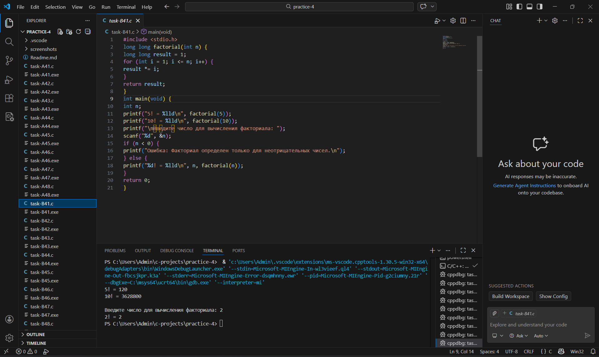

Задание 4.2: Факториал (рекурсивно)
Постановка задачи
Напишите рекурсивную функцию long long factorial_rec(int n).

Математическая модель
Рекурсивное определение факториала:

База: 0! = 1

Рекурсия: n! = n * (n-1)!

Список идентификаторов
Имя	Тип	Описание
n	int	Число, для которого вычисляется факториал
Код программы
#include <stdio.h>

long long factorial_rec(int n) {
    if (n == 0) {
        return 1;
    }
    else {
        return n * factorial_rec(n - 1);
    }
}

int main(void) {
    printf("5! = %lld\n", factorial_rec(5));    
    printf("10! = %lld\n", factorial_rec(10));  
    
    int n;
    printf("\nВведите число для вычисления факториала: ");
    scanf("%d", &n);    
    
    if (n < 0) {
        printf("Ошибка: Факториал определен только для неотрицательных чисел.\n");
    } else {
        printf("%d! = %lld\n", n, factorial_rec(n));
    }    
    
    return 0;
}

Результаты работы
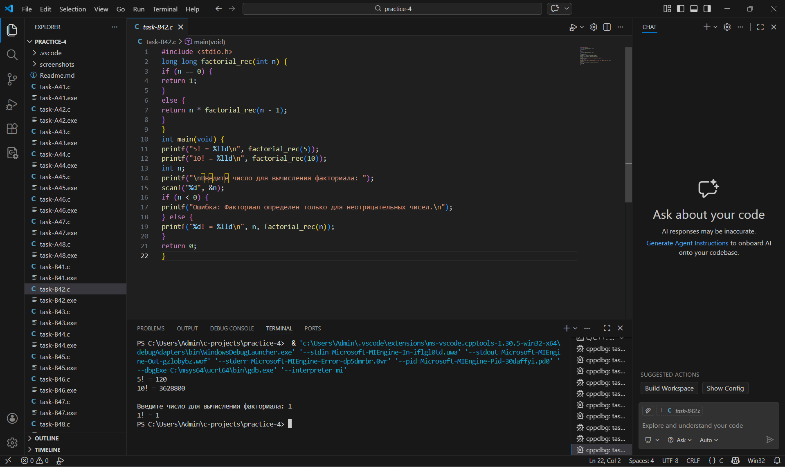

Задание 4.3: Степень числа
Постановка задачи
Напишите функцию double power(double base, int exp), которая возводит число в целую степень (включая отрицательную).

Математическая модель
Для положительной степени: base^exp = base × base × ... × base (exp раз)

Для нулевой степени: base^0 = 1

Для отрицательной степени: base^(-exp) = 1 / base^exp

Список идентификаторов
Имя	Тип	Описание
base	double	Основание степени
exp	int	Показатель степени
result	double	Результат возведения в степень
Код программы
#include <stdio.h>
#include <math.h>  

double power(double base, int exp) {
    double result = 1.0;
    
    if (exp < 0) {
        base = 1.0 / base;
        exp = -exp;
    }
    
    for (int i = 0; i < exp; i++) {
        result *= base;
    }    
    
    return result;
}

int main(void) {
    printf("=== Возведение числа в целую степень ===\n\n");
    
    printf("Тестовые вычисления:\n");
    printf("2^10 = %.0lf\n", power(2, 10));        
    printf("2^(-3) = %.3lf\n", power(2, -3));      
    printf("5^0 = %.0lf\n", power(5, 0));          
    printf("3^5 = %.0lf\n", power(3, 5));          
    printf("10^(-2) = %.3lf\n", power(10, -2));    
    printf("1.5^3 = %.3lf\n", power(1.5, 3));      
    printf("4^(-0.5) = %.3lf\n", power(4, -0.5));      
    
    return 0;
}

Результаты работы
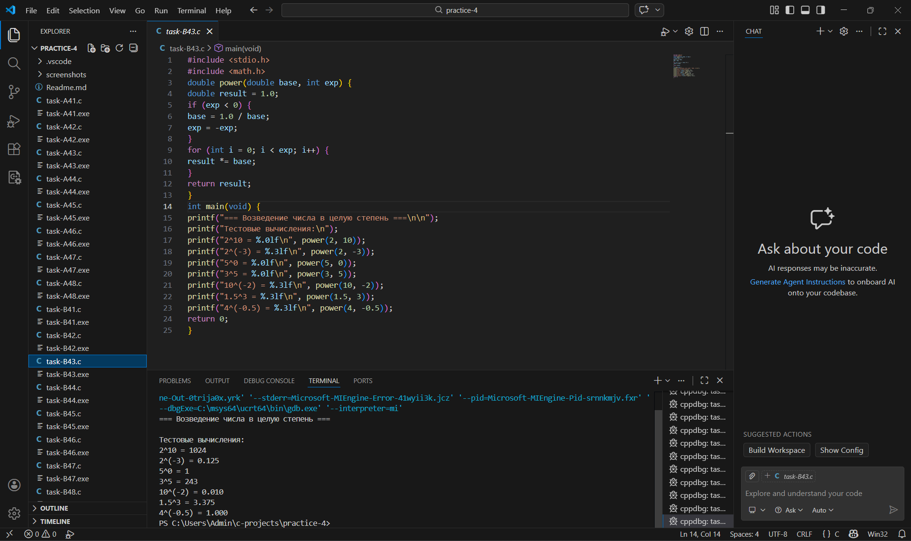

Задание 4.4: Swap
Постановка задачи
Напишите функцию void swap(int *a, int *b), которая меняет местами два числа через указатели.

Список идентификаторов
Имя	Тип	Описание
a, b	int*	Указатели на обмениваемые значения
temp	int	Временная переменная для обмена
Код программы
#include <stdio.h>

void swap(int *a, int *b) {
    int temp = *a;
    *a = *b;        
    *b = temp;      
}

int main(void) {
    printf("=== Функция swap() для обмена значений ===\n\n");
    
    int x = 5, y = 10;
    printf("Пример 1:\n");
    printf("До swap: x = %d, y = %d\n", x, y);
    swap(&x, &y);
    printf("После swap: x = %d, y = %d\n\n", x, y);
    
    int a = 100, b = 200;
    printf("Пример 2:\n");
    printf("До swap: a = %d, b = %d\n", a, b);
    swap(&a, &b);
    printf("После swap: a = %d, b = %d\n\n", a, b);
    
    int m = 7, n = 7;
    printf("Пример 3 (одинаковые значения):\n");
    printf("До swap: m = %d, n = %d\n", m, n);
    swap(&m, &n);
    printf("После swap: m = %d, n = %d\n\n", m, n);    
    
    return 0;
}
Результаты работы
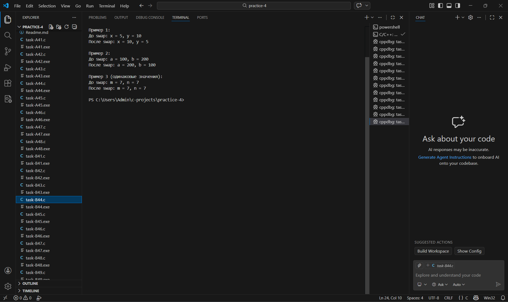

Задание 4.5: Максимум в массиве
Постановка задачи
Напишите функцию int findMax(int *arr, int size), которая находит максимальный элемент массива.

Список идентификаторов
Имя	Тип	Описание
arr	int*	Указатель на массив
size	int	Размер массива
max	int	Максимальный элемент
Код программы
#include <stdio.h>

int findMax(int *arr, int size) {
    if (size <= 0) {
        printf("Ошибка: массив пустой!\n");
        return -1;
    }
    
    int max = arr[0];
    
    for (int i = 1; i < size; i++) {
        if (arr[i] > max) {
            max = arr[i];  
        }
    }
    
    return max;
}

int main(void) {
    printf("=== Функция findMax() для поиска максимального элемента ===\n\n");
    
    int arr1[] = {5, 2, 9, 1, 7};
    int size1 = sizeof(arr1) / sizeof(arr1[0]);  
    
    printf("Массив 1: ");
    for (int i = 0; i < size1; i++) {
        printf("%d ", arr1[i]);
    }
    printf("\n");
    printf("Максимальный элемент: %d\n\n", findMax(arr1, size1));
    
    return 0;
}
Результаты работы
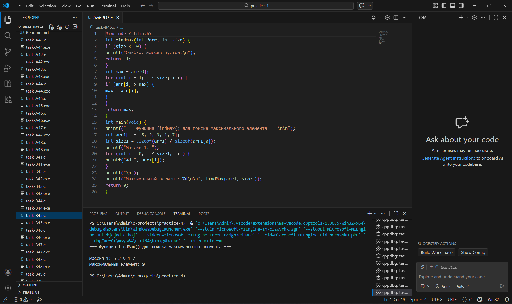

Задание 4.6: Индекс максимума
Постановка задачи
Напишите функцию int findMaxIndex(int *arr, int size), которая возвращает индекс максимального элемента.

Список идентификаторов
Имя	Тип	Описание
arr	int*	Указатель на массив
size	int	Размер массива
max_index	int	Индекс максимального элемента
Код программы
#include <stdio.h>

int findMaxIndex(int *arr, int size) {
    if (size <= 0) {
        printf("Ошибка: массив пустой!\n");
        return -1;
    }
    
    int max_index = 0;
    
    for (int i = 1; i < size; i++) {
        if (arr[i] > arr[max_index]) {
            max_index = i;  
        }
    }
    
    return max_index;
}

int main(void) {
    printf("=== Функция findMaxIndex() для поиска индекса максимального элемента ===\n\n");
    
    int arr[] = {5, 2, 9, 1, 7};
    int size = sizeof(arr) / sizeof(arr[0]);
    
    printf("Массив: ");
    for (int i = 0; i < size; i++) {
        printf("%d ", arr[i]);
    }
    printf("\n");
    
    int max_index = findMaxIndex(arr, size);
    printf("Индекс максимального элемента: %d\n", max_index);
    printf("Значение максимального элемента: arr[%d] = %d\n\n", max_index, arr[max_index]);
    
    return 0;
}

Результаты работы
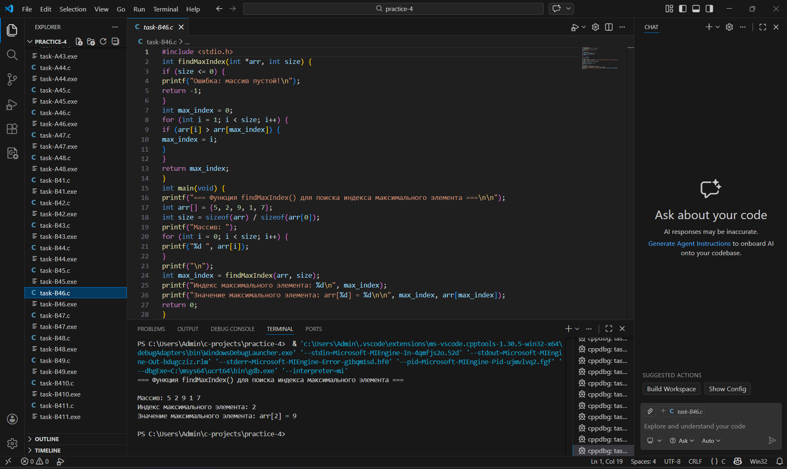

Задание 4.7: Длина строки
Постановка задачи
Напишите функцию int my_strlen(char *str), которая возвращает длину строки (без использования strlen).

Математическая модель
Строка в C заканчивается нулевым символом '\0'. Длина строки — количество символов до этого символа.

Список идентификаторов
Имя	Тип	Описание
str	char*	Указатель на строку
length	int	Длина строки
Код программы

#include <stdio.h>

int my_strlen(char *str) {
    int length = 0;
    while (str[length] != '\0') {
        length++;
    }    
    return length;
}

int main(void) {
    printf("=== Функция my_strlen() для вычисления длины строки ===\n\n");
    
    printf("Тестовые строки:\n");
    printf("1. \"Hello\" - длина: %d\n", my_strlen("Hello"));      
    printf("2. \"\" (пустая строка) - длина: %d\n", my_strlen("")); 
    printf("3. \"C Programming\" - длина: %d\n", my_strlen("C Programming")); 
    
    char str[100];
    printf("\nВведите строку для вычисления длины: ");
    fgets(str, sizeof(str), stdin);
    
    int i = 0;
    while (str[i] != '\0') {
        if (str[i] == '\n') {
            str[i] = '\0';
            break;
        }
        i++;
    }    
    
    printf("Длина введенной строки: %d\n", my_strlen(str));    
    
    return 0;
}

Результаты работы
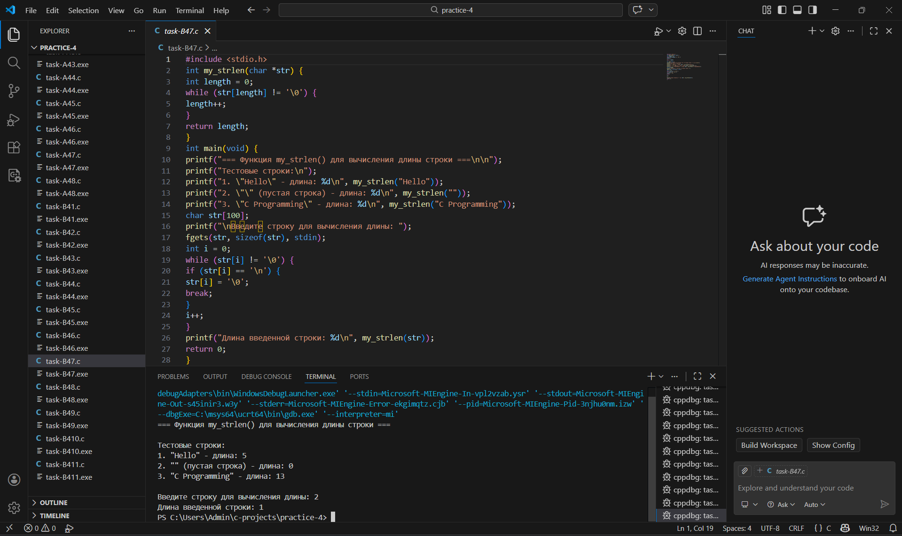

Задание 4.8: Копирование строки
Постановка задачи
Напишите функцию void my_strcpy(char *dest, char *src), которая копирует строку src в dest.

Список идентификаторов
Имя	Тип	Описание
dest	char*	Указатель на строку-приёмник
src	char*	Указатель на строку-источник
i	int	Индекс для копирования
Код программы

#include <stdio.h>

void my_strcpy(char *dest, char *src) {
    int i = 0;
    while (src[i] != '\0') {
        dest[i] = src[i];
        i++;
    }
    dest[i] = '\0';
}

int main(void) {
    printf("=== Функция my_strcpy() для копирования строк ===\n\n");    
    
    char source[] = "Hello, World!";
    char destination[50];    
    
    printf("Исходная строка: \"%s\"\n", source);
    printf("До копирования: destination = \"%s\"\n", destination);    
    
    my_strcpy(destination, source);    
    
    printf("После копирования: destination = \"%s\"\n", destination);    
    
    return 0;
}

Результаты работы
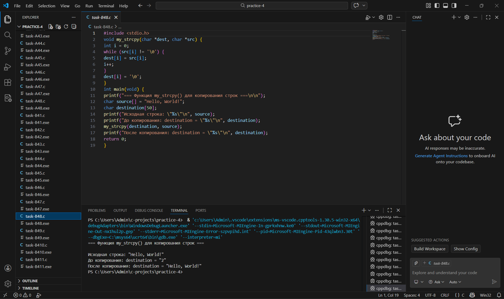

Задание 4.9: Реверс строки
Постановка задачи
Напишите функцию void reverse(char *str), которая переворачивает строку "на месте".

Математическая модель
Алгоритм реверса: менять местами символы с начала и конца, двигаясь к середине.

Список идентификаторов
Имя	Тип	Описание
str	char*	Указатель на строку
length	int	Длина строки
temp	char	Временная переменная для обмена
Код программы

#include <stdio.h>

void reverse(char *str) {
    if (str == NULL) {
        return;
    }
    
    int length = 0;
    while (str[length] != '\0') {
        length++;
    }
    
    for (int i = 0; i < length / 2; i++) {
        char temp = str[i];
        str[i] = str[length - 1 - i];
        str[length - 1 - i] = temp;
    }
}

int main(void) {
    printf("=== Функция reverse() для переворачивания строки ===\n\n");
    
    char str1[] = "Hello";
    printf("Пример 1:\n");
    printf("До reverse: \"%s\"\n", str1);
    reverse(str1);
    printf("После reverse: \"%s\"\n\n", str1);
    
    return 0;
}
Результаты работы
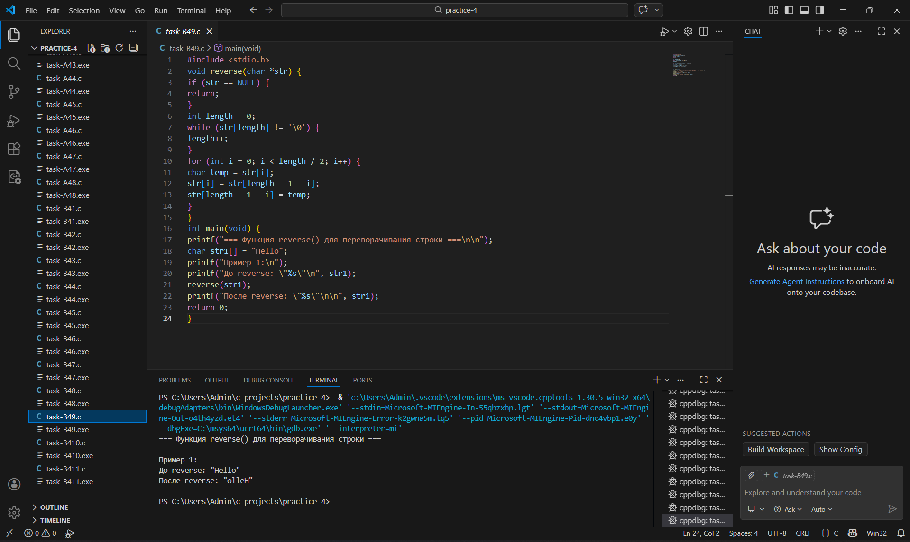

Задание 4.10: Минимум и максимум через указатели
Постановка задачи
Напишите функцию void findMinMax(int *arr, int size, int *min, int *max), которая находит минимум и максимум одновременно и записывает их по указателям.

Список идентификаторов
Имя	Тип	Описание
arr	int*	Указатель на массив
size	int	Размер массива
min	int*	Указатель для записи минимума
max	int*	Указатель для записи максимума
Код программы

#include <stdio.h>

void findMinMax(int *arr, int size, int *min, int *max) {
    if (size <= 0) {
        printf("Ошибка: массив пустой!\n");
        *min = *max = 0;
        return;
    }
    
    *min = arr[0];
    *max = arr[0];
    
    for (int i = 1; i < size; i++) {
        if (arr[i] < *min) {
            *min = arr[i];
        }
        if (arr[i] > *max) {
            *max = arr[i];
        }
    }
}

int main(void) {
    printf("=== Функция findMinMax() для одновременного поиска минимума и максимума ===\n\n");
    
    int arr[] = {5, 2, 9, 1, 7};
    int size = sizeof(arr) / sizeof(arr[0]);
    int min, max;    
    
    printf("Массив: ");
    for (int i = 0; i < size; i++) {
        printf("%d ", arr[i]);
    }
    printf("\n");    
    
    findMinMax(arr, size, &min, &max);    
    
    printf("Минимум: %d\n", min);
    printf("Максимум: %d\n", max);
    printf("Размах: %d\n\n", max - min);    
    
    return 0;
}

Результаты работы
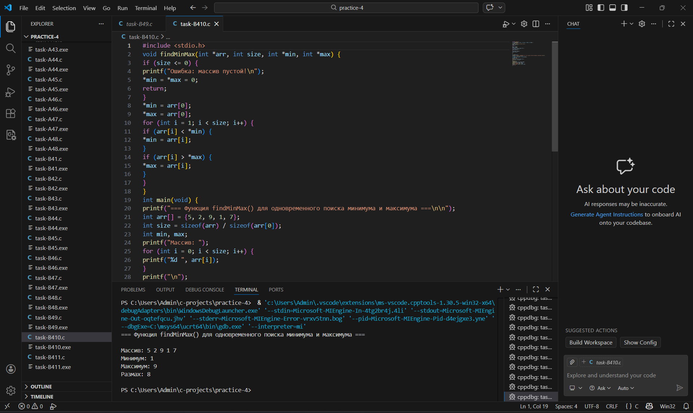

Задание 4.11: Сортировка массива
Постановка задачи
Напишите функцию void sortArray(int *arr, int size), которая сортирует массив по возрастанию (любым методом).

Математическая модель
Сортировка пузырьком:

Сравниваем соседние элементы

Если левый больше правого, меняем их местами

Повторяем, пока массив не будет отсортирован

Список идентификаторов
Имя	Тип	Описание
arr	int*	Указатель на массив
size	int	Размер массива
i, j	int	Счётчики циклов
Код программы
#include <stdio.h>

void swap(int *a, int *b) {
    int temp = *a;
    *a = *b;
    *b = temp;
}

void sortArrayBubble(int *arr, int size) {
    for (int i = 0; i < size - 1; i++) {
        for (int j = 0; j < size - i - 1; j++) {
            if (arr[j] > arr[j + 1]) {
                swap(&arr[j], &arr[j + 1]);
            }
        }
    }
}

int main(void) {
    printf("=== Сортировка массива по возрастанию (пузырьковая сортировка) ===\n\n");   
    
    int arr[] = {64, 34, 25, 12, 22};
    int size = sizeof(arr) / sizeof(arr[0]);    
    
    printf("Исходный массив: ");
    for (int i = 0; i < size; i++) {
        printf("%d ", arr[i]);
    }
    printf("\n");    
    
    sortArrayBubble(arr, size);   
    
    printf("Отсортированный массив: ");
    for (int i = 0; i < size; i++) {
        printf("%d ", arr[i]);
    }
    printf("\n");    
    
    return 0;
}

Результаты работы

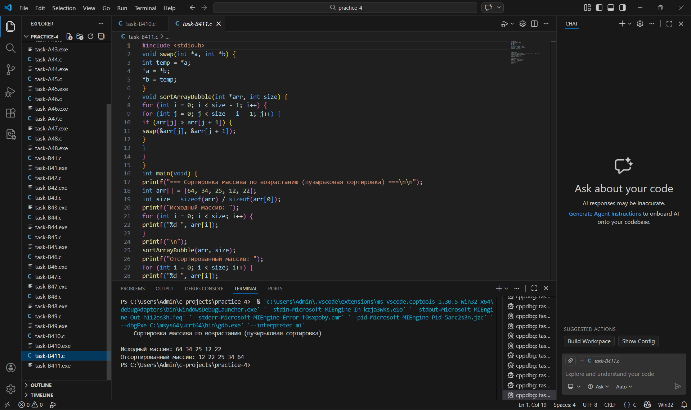
