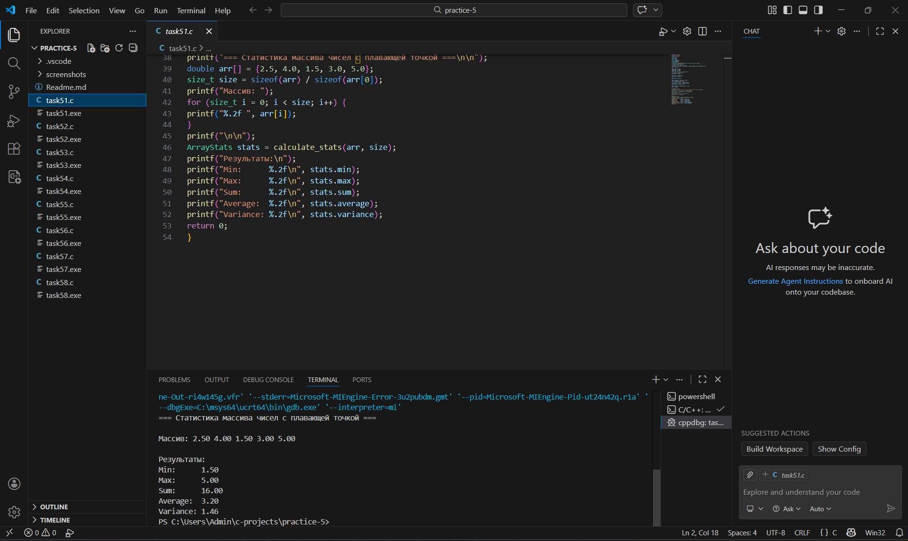
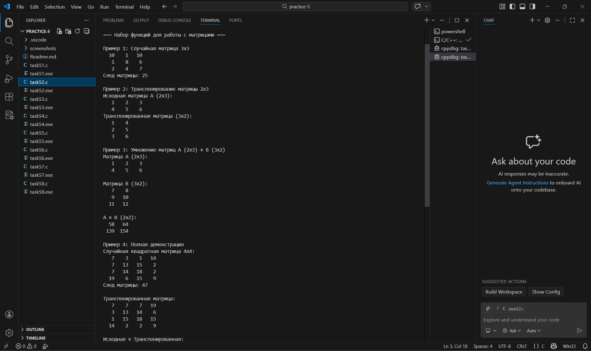
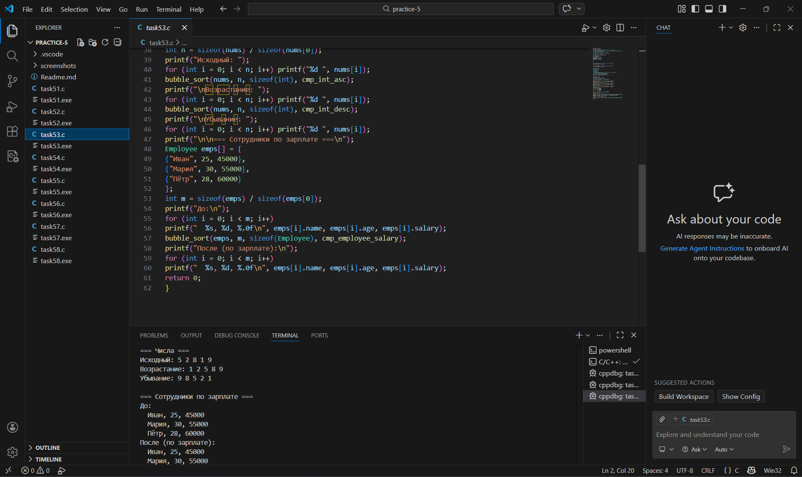
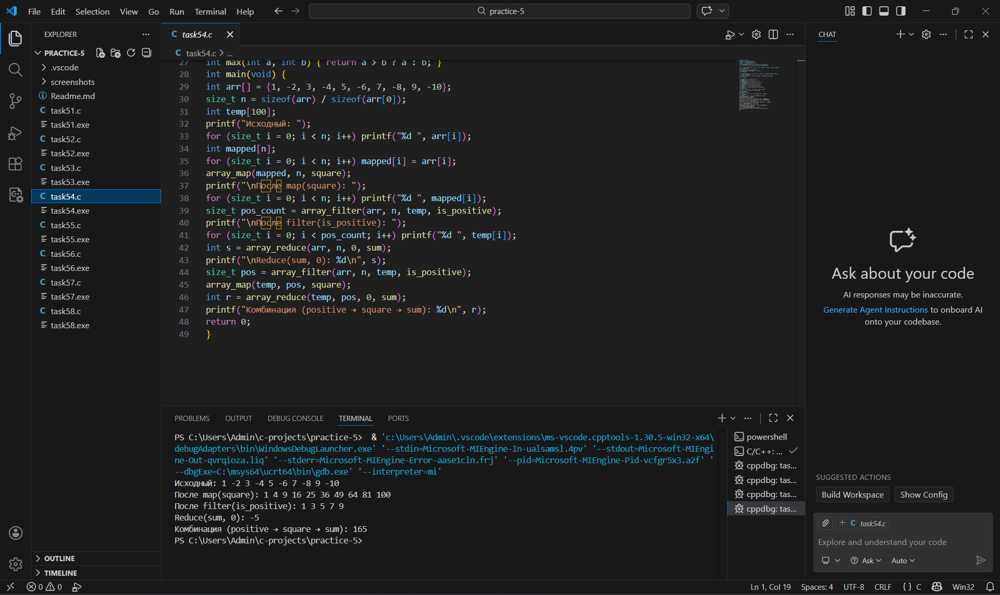
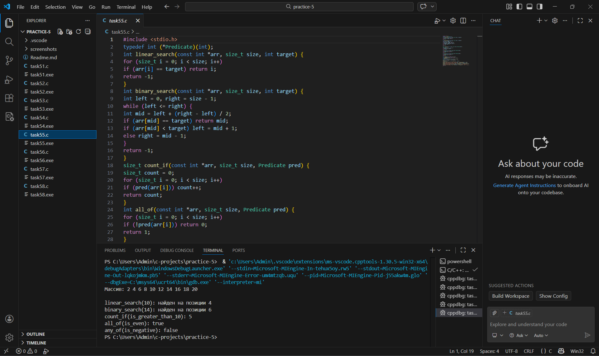
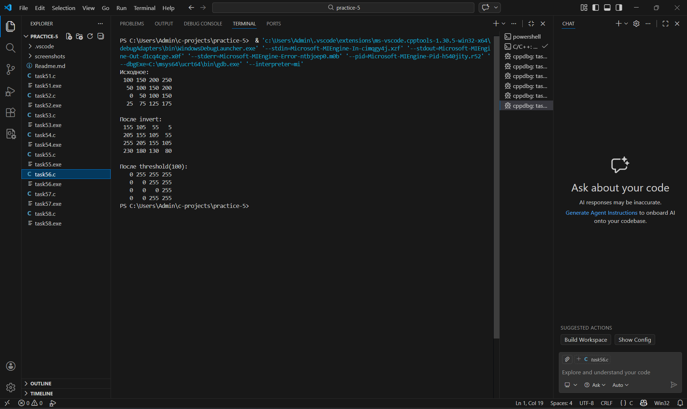
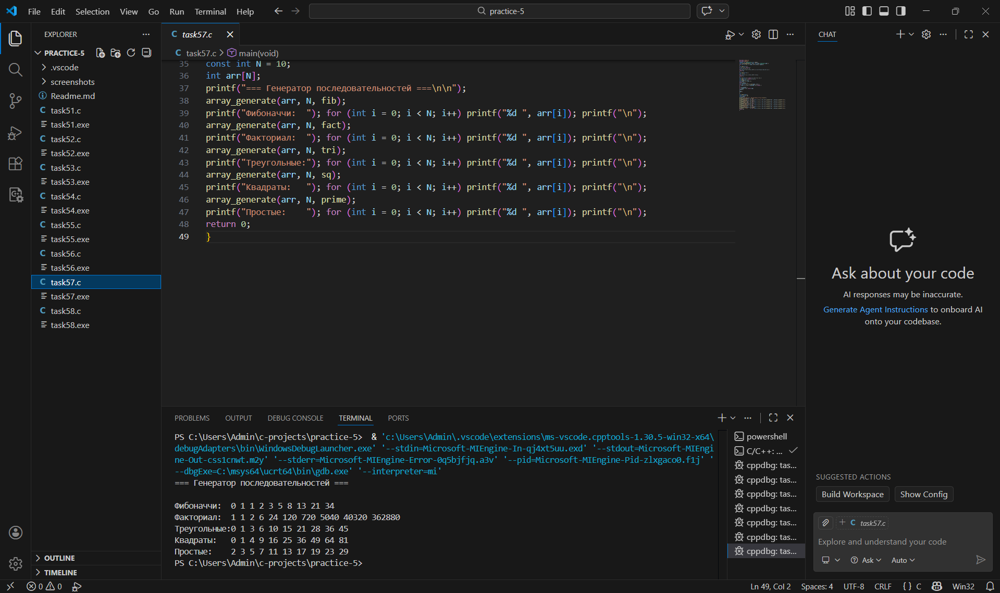
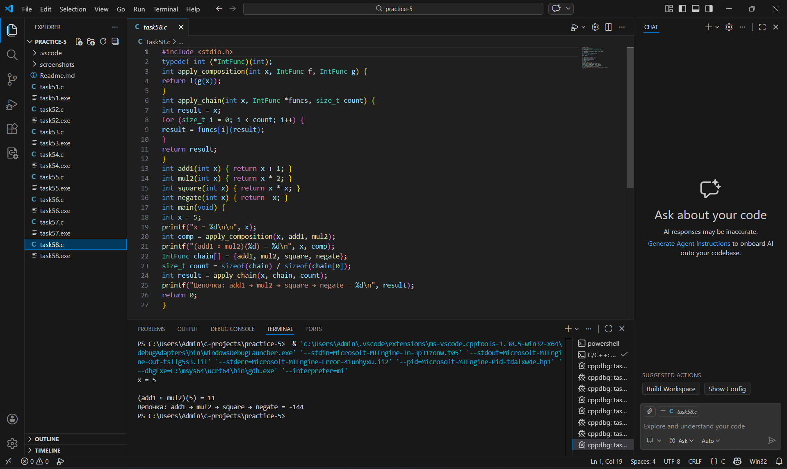

Практическая работа 5: Функции и массивы (продвинутый уровень)
Студент: Карасев Арсений Алексеевич
Группа: 1зб_ИВТ-25
Дата: 18 февраля 2026 г.
Задание 5.1: Статистика массива
Постановка задачи
Напишите функцию, которая вычисляет статистику массива чисел с плавающей точкой: минимум, максимум, сумму, среднее арифметическое и дисперсию.

Математическая модель
Среднее арифметическое: $\bar{x} = \frac{1}{n}\sum_{i=1}^{n} x_i$

Дисперсия: $\sigma^2 = \frac{1}{n}\sum_{i=1}^{n} (x_i - \bar{x})^2$

Список идентификаторов
Имя	Тип	Описание
arr	const double*	Указатель на массив данных
size	size_t	Размер массива
stats	ArrayStats	Структура со статистикой
variance_sum	double	Сумма квадратов отклонений
Код программы
#include <stdio.h>
#include <math.h>

typedef struct {
    double min;
    double max;
    double sum;
    double average;
    double variance;
} ArrayStats;

ArrayStats calculate_stats(const double *arr, size_t size) {
    ArrayStats stats = {0};
    
    if (size == 0 || arr == NULL) {
        stats.min = stats.max = stats.sum = stats.average = stats.variance = 0.0;
        return stats;
    }
    
    stats.min = arr[0];
    stats.max = arr[0];
    stats.sum = arr[0];
    
    for (size_t i = 1; i < size; i++) {
        if (arr[i] < stats.min) {
            stats.min = arr[i];
        }
        if (arr[i] > stats.max) {
            stats.max = arr[i];
        }
        stats.sum += arr[i];
    }
    
    stats.average = stats.sum / size;
    
    double variance_sum = 0.0;
    for (size_t i = 0; i < size; i++) {
        double diff = arr[i] - stats.average;
        variance_sum += diff * diff;
    }
    stats.variance = variance_sum / size;    
    
    return stats;
}

int main(void) {
    printf("=== Статистика массива чисел с плавающей точкой ===\n\n");
    
    double arr[] = {2.5, 4.0, 1.5, 3.0, 5.0};
    size_t size = sizeof(arr) / sizeof(arr[0]);   
    
    printf("Массив: ");
    for (size_t i = 0; i < size; i++) {
        printf("%.2f ", arr[i]);
    }
    printf("\n\n");    
    
    ArrayStats stats = calculate_stats(arr, size);    
    
    printf("Результаты:\n");
    printf("Min:      %.2f\n", stats.min);
    printf("Max:      %.2f\n", stats.max);
    printf("Sum:      %.2f\n", stats.sum);
    printf("Average:  %.2f\n", stats.average);
    printf("Variance: %.2f\n", stats.variance);
    
    return 0;
}
Результаты работы

Задание 5.2: Операции с матрицами (VLA)
Постановка задачи
Реализуйте набор функций для работы с матрицами произвольного размера с использованием массивов переменной длины (VLA).

Список идентификаторов
Имя	Тип	Описание
rows, cols	int	Размеры матрицы
m, src, dst	int[][]	Матрицы
a, b, result	int[][]	Матрицы для умножения
trace	int	След матрицы
Код программы
#include <stdio.h>
#include <stdlib.h>
#include <time.h>

void matrix_random(int rows, int cols, int m[rows][cols], int min, int max) {
    for (int i = 0; i < rows; i++) {
        for (int j = 0; j < cols; j++) {
            m[i][j] = min + rand() % (max - min + 1);
        }
    }
}

void matrix_print(int rows, int cols, int m[rows][cols]) {
    for (int i = 0; i < rows; i++) {
        for (int j = 0; j < cols; j++) {
            printf("%4d ", m[i][j]);
        }
        printf("\n");
    }
}

void matrix_transpose(int rows, int cols, int src[rows][cols], int dst[cols][rows]) {
    for (int i = 0; i < rows; i++) {
        for (int j = 0; j < cols; j++) {
            dst[j][i] = src[i][j];
        }
    }
}

int matrix_multiply(int r1, int c1, int a[r1][c1],
                    int r2, int c2, int b[r2][c2],
                    int result[r1][c2]) {
    if (c1 != r2) {
        printf("Ошибка: число столбцов матрицы A (%d) не равно числу строк матрицы B (%d)\n", c1, r2);
        return -1;
    }
    
    for (int i = 0; i < r1; i++) {
        for (int j = 0; j < c2; j++) {
            result[i][j] = 0;
        }
    }
    
    for (int i = 0; i < r1; i++) {
        for (int j = 0; j < c2; j++) {
            for (int k = 0; k < c1; k++) {
                result[i][j] += a[i][k] * b[k][j];
            }
        }
    }    
    
    return 0;
}

int matrix_trace(int n, int m[n][n]) {
    int trace = 0;
    for (int i = 0; i < n; i++) {
        trace += m[i][i];
    }
    return trace;
}

int main(void) {
    srand(time(NULL));    
    
    printf("=== Набор функций для работы с матрицами ===\n\n");
    
    printf("Пример 1: Случайная матрица 3x3\n");
    int mat1[3][3];
    matrix_random(3, 3, mat1, 1, 10);
    matrix_print(3, 3, mat1);
    printf("След матрицы: %d\n\n", matrix_trace(3, mat1));
    
    printf("Пример 2: Транспонирование матрицы 2x3\n");
    int a[2][3] = {{1, 2, 3}, {4, 5, 6}};
    int a_trans[3][2];    
    
    printf("Исходная матрица A (2x3):\n");
    matrix_print(2, 3, a);    
    
    matrix_transpose(2, 3, a, a_trans);
    printf("Транспонированная матрица (3x2):\n");
    matrix_print(3, 2, a_trans);
    printf("\n");
    
    printf("Пример 3: Умножение матриц A (2x3) × B (3x2)\n");    
    
    int A[2][3] = {{1, 2, 3}, {4, 5, 6}};
    int B[3][2] = {{7, 8}, {9, 10}, {11, 12}};
    int C[2][2];    
    
    printf("Матрица A (2x3):\n");
    matrix_print(2, 3, A);
    printf("\nМатрица B (3x2):\n");
    matrix_print(3, 2, B);    
    
    int result = matrix_multiply(2, 3, A, 3, 2, B, C);
    if (result == 0) {
        printf("\nA × B (2x2):\n");
        matrix_print(2, 2, C);
    }
    printf("\n");
    
    printf("Пример 4: Полная демонстрация\n");
    int n = 4;
    int square[4][4];
    printf("Случайная квадратная матрица %dx%d:\n", n, n);
    matrix_random(n, n, square, 1, 20);
    matrix_print(n, n, square);
    printf("След матрицы: %d\n\n", matrix_trace(n, square));
    
    int square_trans[4][4];
    matrix_transpose(n, n, square, square_trans);
    printf("Транспонированная матрица:\n");
    matrix_print(n, n, square_trans);
    
    int product[4][4];
    result = matrix_multiply(n, n, square, n, n, square_trans, product);
    if (result == 0) {
        printf("\nИсходная × Транспонированная:\n");
        matrix_print(n, n, product);
    }
    
    return 0;
}

Результаты работы

Задание 5.3: Сортировка с компаратором
Постановка задачи
Реализуйте универсальную функцию сортировки с callback-компаратором для разных типов данных.

Список идентификаторов
Имя	Тип	Описание
base	void*	Указатель на массив
count	size_t	Количество элементов
size	size_t	Размер элемента
cmp	Comparator	Функция сравнения
Код программы
#include <stdio.h>
#include <string.h>

typedef int (*Comparator)(const void*, const void*);

void bubble_sort(void *base, size_t n, size_t size, Comparator cmp) {
    char *arr = (char*)base;
    for (size_t i = 0; i < n - 1; i++) {
        for (size_t j = 0; j < n - i - 1; j++) {
            void *a = arr + j * size;
            void *b = arr + (j + 1) * size;
            if (cmp(a, b) > 0) {
                char tmp[size];
                memcpy(tmp, a, size);
                memcpy(a, b, size);
                memcpy(b, tmp, size);
            }
        }
    }
}

int cmp_int_asc(const void *a, const void *b) {
    return *(int*)a - *(int*)b;
}

int cmp_int_desc(const void *a, const void *b) {
    return *(int*)b - *(int*)a;
}

typedef struct {
    char name[50];
    int age;
    double salary;
} Employee;

int cmp_employee_salary(const void *a, const void *b) {
    double sa = ((Employee*)a)->salary;
    double sb = ((Employee*)b)->salary;
    return (sa > sb) - (sa < sb);  // -1, 0, 1
}

int main(void) {
    printf("=== Числа ===\n");
    int nums[] = {5, 2, 8, 1, 9};
    int n = sizeof(nums) / sizeof(nums[0]);    
    
    printf("Исходный: ");
    for (int i = 0; i < n; i++) printf("%d ", nums[i]);    
    
    bubble_sort(nums, n, sizeof(int), cmp_int_asc);
    printf("\nВозрастание: ");
    for (int i = 0; i < n; i++) printf("%d ", nums[i]);   
    
    bubble_sort(nums, n, sizeof(int), cmp_int_desc);
    printf("\nУбывание: ");
    for (int i = 0; i < n; i++) printf("%d ", nums[i]);
    
    printf("\n\n=== Сотрудники по зарплате ===\n");
    Employee emps[] = {
        {"Иван", 25, 45000},
        {"Мария", 30, 55000},
        {"Пётр", 28, 60000}
    };
    int m = sizeof(emps) / sizeof(emps[0]);    
    
    printf("До:\n");
    for (int i = 0; i < m; i++) 
        printf("  %s, %d, %.0f\n", emps[i].name, emps[i].age, emps[i].salary);    
    
    bubble_sort(emps, m, sizeof(Employee), cmp_employee_salary);    
    
    printf("После (по зарплате):\n");
    for (int i = 0; i < m; i++) 
        printf("  %s, %d, %.0f\n", emps[i].name, emps[i].age, emps[i].salary);
    
    return 0;
}

Результаты работы

Задание 5.4: Функциональные операции над массивами
Постановка задачи
Реализуйте функции высшего порядка для работы с массивами: map, filter, reduce.

Список идентификаторов
Имя	Тип	Описание
Transform	typedef int (*)(int)	Функция преобразования
Predicate	typedef int (*)(int)	Функция-условие
Reducer	typedef int (*)(int, int)	Функция свёртки
Код программы

#include <stdio.h>

typedef int (*Transform)(int);
typedef int (*Predicate)(int);
typedef int (*Reducer)(int, int);

void array_map(int *arr, size_t size, Transform func) {
    for (size_t i = 0; i < size; i++) arr[i] = func(arr[i]);
}

size_t array_filter(const int *src, size_t size, int *dst, Predicate pred) {
    size_t count = 0;
    for (size_t i = 0; i < size; i++) 
        if (pred(src[i])) dst[count++] = src[i];
    return count;
}

int array_reduce(const int *arr, size_t size, int initial, Reducer func) {
    int result = initial;
    for (size_t i = 0; i < size; i++) result = func(result, arr[i]);
    return result;
}

int square(int x) { return x * x; }
int negate(int x) { return -x; }
int double_val(int x) { return x * 2; }
int abs_val(int x) { return x < 0 ? -x : x; }

int is_positive(int x) { return x > 0; }
int is_even(int x) { return x % 2 == 0; }

int sum(int a, int b) { return a + b; }
int product(int a, int b) { return a * b; }
int max(int a, int b) { return a > b ? a : b; }

int main(void) {
    int arr[] = {1, -2, 3, -4, 5, -6, 7, -8, 9, -10};
    size_t n = sizeof(arr) / sizeof(arr[0]);
    int temp[100];    
    
    printf("Исходный: ");
    for (size_t i = 0; i < n; i++) printf("%d ", arr[i]);
    
    int mapped[n];
    for (size_t i = 0; i < n; i++) mapped[i] = arr[i];
    array_map(mapped, n, square);
    printf("\nПосле map(square): ");
    for (size_t i = 0; i < n; i++) printf("%d ", mapped[i]);
    
    size_t pos_count = array_filter(arr, n, temp, is_positive);
    printf("\nПосле filter(is_positive): ");
    for (size_t i = 0; i < pos_count; i++) printf("%d ", temp[i]);
    
    int s = array_reduce(arr, n, 0, sum);
    printf("\nReduce(sum, 0): %d\n", s);
    
    size_t pos = array_filter(arr, n, temp, is_positive);
    array_map(temp, pos, square);
    int r = array_reduce(temp, pos, 0, sum);
    printf("Комбинация (positive → square → sum): %d\n", r);    
    
    return 0;
}

Результаты работы

Задание 5.5: Поиск в массиве
Постановка задачи
Реализуйте различные алгоритмы поиска в массиве.

Список идентификаторов
Имя	Тип	Описание
linear_search	int (*)(const int*, size_t, int)	Линейный поиск
binary_search	int (*)(const int*, size_t, int)	Бинарный поиск
count_if	size_t (*)(const int*, size_t, Predicate)	Подсчёт по условию
Код программы

#include <stdio.h>

typedef int (*Predicate)(int);

int linear_search(const int *arr, size_t size, int target) {
    for (size_t i = 0; i < size; i++) 
        if (arr[i] == target) return i;
    return -1;
}

int binary_search(const int *arr, size_t size, int target) {
    int left = 0, right = size - 1;
    while (left <= right) {
        int mid = left + (right - left) / 2;
        if (arr[mid] == target) return mid;
        if (arr[mid] < target) left = mid + 1;
        else right = mid - 1;
    }
    return -1;
}

size_t count_if(const int *arr, size_t size, Predicate pred) {
    size_t count = 0;
    for (size_t i = 0; i < size; i++) 
        if (pred(arr[i])) count++;
    return count;
}

int all_of(const int *arr, size_t size, Predicate pred) {
    for (size_t i = 0; i < size; i++) 
        if (!pred(arr[i])) return 0;
    return 1;
}

int any_of(const int *arr, size_t size, Predicate pred) {
    for (size_t i = 0; i < size; i++) 
        if (pred(arr[i])) return 1;
    return 0;
}

int is_even(int x) { return x % 2 == 0; }
int is_negative(int x) { return x < 0; }
int is_greater_than_10(int x) { return x > 10; }

int main(void) {
    int arr[] = {2, 4, 6, 8, 10, 12, 14, 16, 18, 20};
    size_t n = sizeof(arr) / sizeof(arr[0]);    
    
    printf("Массив: ");
    for (size_t i = 0; i < n; i++) printf("%d ", arr[i]);
    printf("\n\n");    
    
    printf("linear_search(10): найден на позиции %d\n", linear_search(arr, n, 10));
    printf("binary_search(14): найден на позиции %d\n", binary_search(arr, n, 14));
    printf("count_if(is_greater_than_10): %zu\n", count_if(arr, n, is_greater_than_10));
    printf("all_of(is_even): %s\n", all_of(arr, n, is_even) ? "true" : "false");
    printf("any_of(is_negative): %s\n", any_of(arr, n, is_negative) ? "true" : "false");
    
    return 0;
}

Результаты работы

Задание 5.6: Обработка изображений
Постановка задачи
Реализуйте функции для обработки изображений (матрица яркости пикселей): инвертирование и пороговая фильтрация.

Список идентификаторов
Имя	Тип	Описание
img	int[r][c]	Матрица яркости
MAX_BRIGHTNESS	#define	Максимальная яркость (255)
Код программы

#include <stdio.h>

#define MAX_BRIGHTNESS 255

void invert(int r, int c, int img[r][c]) {
    for (int i = 0; i < r; i++)
        for (int j = 0; j < c; j++)
            img[i][j] = MAX_BRIGHTNESS - img[i][j];
}

void threshold(int r, int c, int img[r][c], int t) {
    for (int i = 0; i < r; i++)
        for (int j = 0; j < c; j++)
            img[i][j] = (img[i][j] > t) ? MAX_BRIGHTNESS : 0;
}

void print_img(int r, int c, int img[r][c]) {
    for (int i = 0; i < r; i++) {
        for (int j = 0; j < c; j++)
            printf("%4d", img[i][j]);
        printf("\n");
    }
}

int main(void) {
    int img1[4][4] = {
        {100, 150, 200, 250},
        {50, 100, 150, 200},
        {0, 50, 100, 150},
        {25, 75, 125, 175}
    };    
    
    int img2[4][4] = {
        {100, 150, 200, 250},
        {50, 100, 150, 200},
        {0, 50, 100, 150},
        {25, 75, 125, 175}
    };    
    
    printf("Исходное:\n");
    print_img(4, 4, img1);    
    
    invert(4, 4, img1);
    printf("\nПосле invert:\n");
    print_img(4, 4, img1);    
    
    threshold(4, 4, img2, 100);
    printf("\nПосле threshold(100):\n");
    print_img(4, 4, img2);    
    
    return 0;
}

Результаты работы

Задание 5.7*: Генератор последовательностей
Постановка задачи
Реализуйте функцию для заполнения массива значениями от генератора и набор генераторов для различных числовых последовательностей.

Список идентификаторов
Имя	Тип	Описание
Generator	typedef int (*)(int)	Тип функции-генератора
array_generate	void (*)(int*, int, Generator)	Заполнение массива
Код программы

#include <stdio.h>
#include <math.h>

typedef int (*Generator)(int index);

void array_generate(int *arr, int size, Generator gen) {
    for (int i = 0; i < size; i++) arr[i] = gen(i);
}

int fib(int n) {
    if (n <= 1) return n;
    int a = 0, b = 1, c;
    for (int i = 2; i <= n; i++) { c = a + b; a = b; b = c; }
    return b;
}

int fact(int n) {
    int r = 1;
    for (int i = 1; i <= n; i++) r *= i;
    return r;
}

int tri(int n) { return n * (n + 1) / 2; }

int sq(int n) { return n * n; }

int prime(int n) {
    int count = 0, num = 2;
    while (1) {
        int is_prime = 1;
        for (int i = 2; i <= sqrt(num); i++) {
            if (num % i == 0) { is_prime = 0; break; }
        }
        if (is_prime) {
            if (count == n) return num;
            count++;
        }
        num++;
    }
}

int main(void) {
    const int N = 10;
    int arr[N];    
    
    printf("=== Генератор последовательностей ===\n\n");    
    
    array_generate(arr, N, fib);
    printf("Фибоначчи:  "); for (int i = 0; i < N; i++) printf("%d ", arr[i]); printf("\n");    
    
    array_generate(arr, N, fact);
    printf("Факториал:  "); for (int i = 0; i < N; i++) printf("%d ", arr[i]); printf("\n");    
    
    array_generate(arr, N, tri);
    printf("Треугольные:"); for (int i = 0; i < N; i++) printf("%d ", arr[i]); printf("\n");    
    
    array_generate(arr, N, sq);
    printf("Квадраты:   "); for (int i = 0; i < N; i++) printf("%d ", arr[i]); printf("\n");    
    
    array_generate(arr, N, prime);
    printf("Простые:    "); for (int i = 0; i < N; i++) printf("%d ", arr[i]); printf("\n");    
    
    return 0;
}

Результаты работы

Задание 5.8*: Композиция функций
Постановка задачи
Реализуйте функции для композиции и последовательного применения функций.

Список идентификаторов
Имя	Тип	Описание
IntFunc	typedef int (*)(int)	Тип функции
apply_composition	int (*)(int, IntFunc, IntFunc)	Композиция двух функций
apply_chain	int (*)(int, IntFunc*, size_t)	Цепочка функций
Код программы

#include <stdio.h>

typedef int (*IntFunc)(int);

int apply_composition(int x, IntFunc f, IntFunc g) {
    return f(g(x));
}

int apply_chain(int x, IntFunc *funcs, size_t count) {
    int result = x;
    for (size_t i = 0; i < count; i++) {
        result = funcs[i](result);
    }
    return result;
}

int add1(int x) { return x + 1; }
int mul2(int x) { return x * 2; }
int square(int x) { return x * x; }
int negate(int x) { return -x; }

int main(void) {
    int x = 5;    
    
    printf("x = %d\n\n", x);
    
    int comp = apply_composition(x, add1, mul2);
    printf("(add1 ∘ mul2)(%d) = %d\n", x, comp);
    
    IntFunc chain[] = {add1, mul2, square, negate};
    size_t count = sizeof(chain) / sizeof(chain[0]);    
    
    int result = apply_chain(x, chain, count);
    printf("Цепочка: add1 → mul2 → square → negate = %d\n", result);    
    
    return 0;
}

Результаты работы

