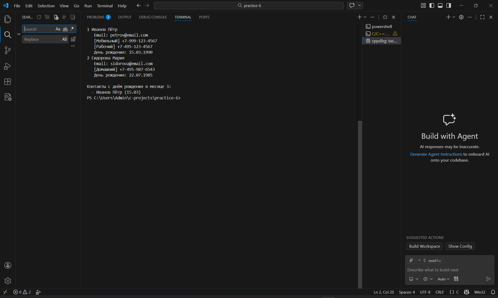
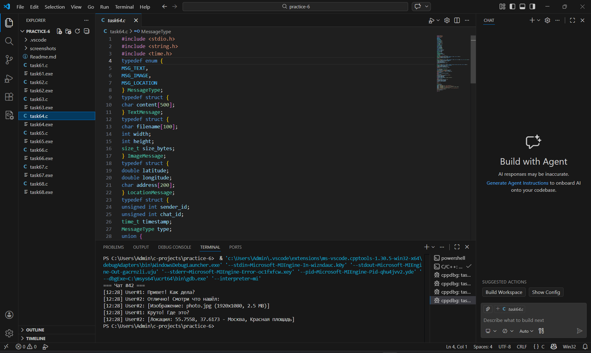
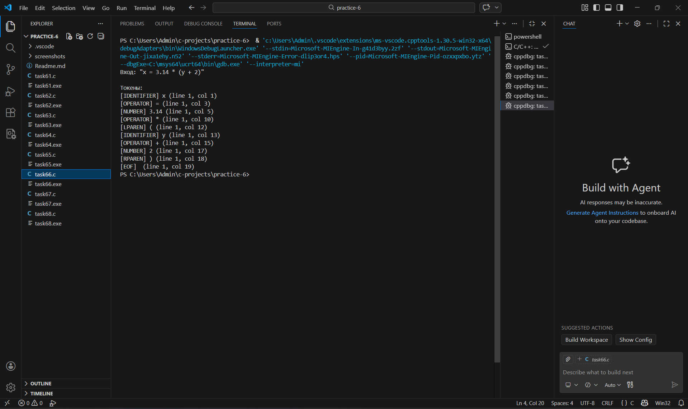
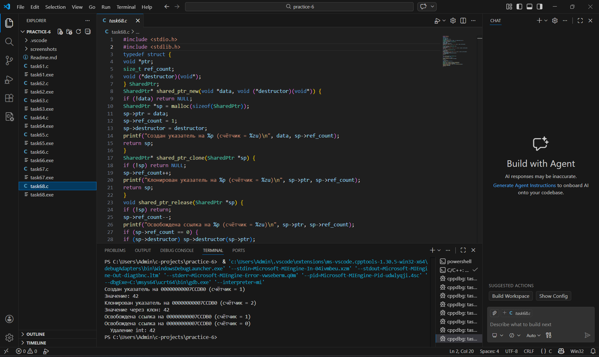

Практическая работа 6: Структуры и объединения
Студент: Карасев Арсений Алексеевич
Группа: 1зб_ИВТ-25
Дата: 18 февраля 2026 г.

Задание 6.1: Адресная книга
Постановка задачи
Создайте систему управления контактами с возможностью добавления, поиска, удаления и сортировки контактов.

Структуры данных
typedef enum { PHONE_HOME, PHONE_WORK, PHONE_MOBILE } PhoneType;

typedef struct {
    PhoneType type;
    char number[20];
} Phone;

typedef struct {
    int day;
    int month;
    int year;
} Date;

typedef struct {
    char first_name[30];
    char last_name[30];
    char email[50];
    Phone phones[3];
    int phone_count;
    Date birthday;
} Contact;

typedef struct {
    Contact contacts[100];
    int count;
} AddressBook;

Список идентификаторов
Имя	Тип	Описание
PhoneType	enum	Тип телефона (домашний, рабочий, мобильный)
Phone	struct	Структура телефона
Date	struct	Структура даты
Contact	struct	Структура контакта
AddressBook	struct	Адресная книга
Код программы

#include <stdio.h>
#include <string.h>

typedef enum { PHONE_HOME, PHONE_WORK, PHONE_MOBILE } PhoneType;

typedef struct {
    PhoneType type;
    char number[20];
} Phone;

typedef struct {
    int day;
    int month;
    int year;
} Date;

typedef struct {
    char first_name[30];
    char last_name[30];
    char email[50];
    Phone phones[3];
    int phone_count;
    Date birthday;
} Contact;

typedef struct {
    Contact contacts[100];
    int count;
} AddressBook;

const char* phone_type_str(PhoneType t) {
    switch(t) {
        case PHONE_HOME: return "Домашний";
        case PHONE_WORK: return "Рабочий";
        case PHONE_MOBILE: return "Мобильный";
        default: return "?";
    }
}

void book_init(AddressBook *b) { b->count = 0; }

int book_add(AddressBook *b, const Contact *c) {
    if (b->count >= 100) return -1;
    b->contacts[b->count++] = *c;
    return b->count - 1;
}

int book_find_by_lastname(const AddressBook *b, const char *last) {
    for (int i = 0; i < b->count; i++)
        if (strcmp(b->contacts[i].last_name, last) == 0)
            return i;
    return -1;
}

int book_find_by_email(const AddressBook *b, const char *email) {
    for (int i = 0; i < b->count; i++)
        if (strcmp(b->contacts[i].email, email) == 0)
            return i;
    return -1;
}

int book_remove(AddressBook *b, int idx) {
    if (idx < 0 || idx >= b->count) return -1;
    for (int i = idx; i < b->count - 1; i++)
        b->contacts[i] = b->contacts[i + 1];
    b->count--;
    return 0;
}

void book_print(const AddressBook *b) {
    printf("\n=== Адресная книга ===\n");
    for (int i = 0; i < b->count; i++) {
        Contact *c = &b->contacts[i];
        printf("%d %s %s\n", i + 1, c->last_name, c->first_name);
        printf("   Email: %s\n", c->email);
        for (int j = 0; j < c->phone_count; j++)
            printf("   [%s] %s\n", phone_type_str(c->phones[j].type), c->phones[j].number);
        printf("   День рождения: %02d.%02d.%04d\n", c->birthday.day, c->birthday.month, c->birthday.year);
    }
}

void book_print_birthdays(const AddressBook *b, int month) {
    printf("\nКонтакты с днём рождения в месяце %d:\n", month);
    for (int i = 0; i < b->count; i++) {
        Contact *c = &b->contacts[i];
        if (c->birthday.month == month)
            printf("  - %s %s (%02d.%02d)\n", c->last_name, c->first_name, c->birthday.day, c->birthday.month);
    }
}

void book_sort_by_lastname(AddressBook *b) {
    for (int i = 0; i < b->count - 1; i++) {
        for (int j = 0; j < b->count - i - 1; j++) {
            if (strcmp(b->contacts[j].last_name, b->contacts[j+1].last_name) > 0) {
                Contact temp = b->contacts[j];
                b->contacts[j] = b->contacts[j+1];
                b->contacts[j+1] = temp;
            }
        }
    }
}

int main(void) {
    AddressBook book;
    book_init(&book);
    
    Contact c1 = {.first_name = "Пётр", .last_name = "Иванов", 
                  .email = "petrov@email.com", .phone_count = 2};
    c1.phones[0] = (Phone){PHONE_MOBILE, "+7-999-123-4567"};
    c1.phones[1] = (Phone){PHONE_WORK, "+7-495-123-4567"};
    c1.birthday = (Date){15, 3, 1990};
    
    Contact c2 = {.first_name = "Мария", .last_name = "Сидорова", 
                  .email = "sidorova@email.com", .phone_count = 1};
    c2.phones[0] = (Phone){PHONE_HOME, "+7-495-987-6543"};
    c2.birthday = (Date){22, 7, 1985};    
    
    book_add(&book, &c1);
    book_add(&book, &c2);    
    
    book_print(&book);
    book_print_birthdays(&book, 3);    
    
    return 0;
}

Результаты работы

Задание 6.2: Геометрические фигуры (Tagged Union)
Постановка задачи
Реализуйте систему для работы с различными геометрическими фигурами с использованием размеченного объединения (tagged union).

Структуры данных

typedef enum {
    SHAPE_CIRCLE,
    SHAPE_RECTANGLE,
    SHAPE_TRIANGLE
} ShapeType;

typedef struct {
    double x, y;
} Point;

typedef struct {
    Point center;
    double radius;
} Circle;

typedef struct {
    Point top_left;
    double width, height;
} Rectangle;

typedef struct {
    Point a, b, c;
} Triangle;

typedef struct {
    ShapeType type;
    union {
        Circle circle;
        Rectangle rectangle;
        Triangle triangle;
    } data;
} Shape;

Список идентификаторов
Имя	Тип	Описание
ShapeType	enum	Тип фигуры
Point	struct	Точка с координатами
Circle	struct	Круг
Rectangle	struct	Прямоугольник
Triangle	struct	Треугольник
Shape	struct	Фигура (tagged union)

Код программы
#include <stdio.h>
#include <math.h>

#define PI 3.14159265358979323846

typedef enum {
    SHAPE_CIRCLE,
    SHAPE_RECTANGLE,
    SHAPE_TRIANGLE
} ShapeType;

typedef struct {
    double x, y;
} Point;

typedef struct {
    Point center;
    double radius;
} Circle;

typedef struct {
    Point top_left;
    double width, height;
} Rectangle;

typedef struct {
    Point a, b, c;
} Triangle;

typedef struct {
    ShapeType type;
    union {
        Circle circle;
        Rectangle rectangle;
        Triangle triangle;
    } data;
} Shape;

double area(const Shape *s) {
    switch (s->type) {
        case SHAPE_CIRCLE:
            return PI * s->data.circle.radius * s->data.circle.radius;
        case SHAPE_RECTANGLE:
            return s->data.rectangle.width * s->data.rectangle.height;
        case SHAPE_TRIANGLE: {
            Point a = s->data.triangle.a;
            Point b = s->data.triangle.b;
            Point c = s->data.triangle.c;
            return fabs((b.x - a.x)*(c.y - a.y) - (c.x - a.x)*(b.y - a.y)) / 2.0;
        }
        default: return 0;
    }
}

double perimeter(const Shape *s) {
    switch (s->type) {
        case SHAPE_CIRCLE:
            return 2 * PI * s->data.circle.radius;
        case SHAPE_RECTANGLE:
            return 2 * (s->data.rectangle.width + s->data.rectangle.height);
        case SHAPE_TRIANGLE: {
            Point a = s->data.triangle.a;
            Point b = s->data.triangle.b;
            Point c = s->data.triangle.c;
            double ab = hypot(b.x - a.x, b.y - a.y);
            double bc = hypot(c.x - b.x, c.y - b.y);
            double ca = hypot(a.x - c.x, a.y - c.y);
            return ab + bc + ca;
        }
        default: return 0;
    }
}

void print_shape(const Shape *s) {
    switch (s->type) {
        case SHAPE_CIRCLE:
            printf("Круг: центр (%.2f, %.2f), радиус %.0f\n", 
                   s->data.circle.center.x, s->data.circle.center.y, 
                   s->data.circle.radius);
            printf("Площадь: %.2f\n", area(s));
            printf("Периметр: %.2f\n", perimeter(s));
            break;            
        case SHAPE_RECTANGLE:
            printf("Прямоугольник: (%.2f, %.2f), %.0f x %.0f\n",
                   s->data.rectangle.top_left.x, s->data.rectangle.top_left.y,
                   s->data.rectangle.width, s->data.rectangle.height);
            printf("Площадь: %.0f\n", area(s));
            printf("Периметр: %.0f\n", perimeter(s));
            break;            
        case SHAPE_TRIANGLE:
            printf("Треугольник: (%.2f, %.2f), (%.2f, %.2f), (%.2f, %.2f)\n",
                   s->data.triangle.a.x, s->data.triangle.a.y,
                   s->data.triangle.b.x, s->data.triangle.b.y,
                   s->data.triangle.c.x, s->data.triangle.c.y);
            printf("Площадь: %.2f\n", area(s));
            printf("Периметр: %.2f\n", perimeter(s));
            break;
    }
}

int main(void) {
    Shape circle = {SHAPE_CIRCLE, .data.circle = {{0, 0}, 5}};
    Shape rectangle = {SHAPE_RECTANGLE, .data.rectangle = {{0, 0}, 4, 3}};
    Shape triangle = {SHAPE_TRIANGLE, .data.triangle = {{0, 0}, {4, 0}, {2, 3}}};    
    
    print_shape(&circle);
    printf("\n");
    print_shape(&rectangle);
    printf("\n");
    print_shape(&triangle);    
    
    return 0;
}

Результаты работы

Задание 6.3: Выражения калькулятора (AST)
Постановка задачи
Реализуйте структуру данных для представления математических выражений в виде абстрактного синтаксического дерева (AST).

Структуры данных

typedef enum {
    EXPR_NUMBER,
    EXPR_VARIABLE,
    EXPR_ADD,
    EXPR_SUB,
    EXPR_MUL
} ExprType;

typedef struct Expr Expr;

struct Expr {
    ExprType type;
    union {
        double number;
        char variable;
        struct { Expr *left; Expr *right; } binary;
    } data;
};

Список идентификаторов
Имя	Тип	Описание
ExprType	enum	Тип выражения
Expr	struct	Узел AST
Context	struct	Контекст с переменными
Код программы
#include <stdio.h>
#include <stdlib.h>
#include <math.h>

typedef enum {
    EXPR_NUMBER,
    EXPR_VARIABLE,
    EXPR_ADD,
    EXPR_SUB,
    EXPR_MUL
} ExprType;

typedef struct Expr Expr;

struct Expr {
    ExprType type;
    union {
        double number;
        char variable;
        struct { Expr *left; Expr *right; } binary;
    } data;
};

Expr* number(double v) { 
    Expr *e = malloc(sizeof(Expr)); 
    e->type = EXPR_NUMBER; 
    e->data.number = v; 
    return e; 
}

Expr* variable(char v) { 
    Expr *e = malloc(sizeof(Expr)); 
    e->type = EXPR_VARIABLE; 
    e->data.variable = v; 
    return e; 
}

Expr* add(Expr *l, Expr *r) { 
    Expr *e = malloc(sizeof(Expr)); 
    e->type = EXPR_ADD; 
    e->data.binary.left = l; 
    e->data.binary.right = r; 
    return e; 
}

Expr* sub(Expr *l, Expr *r) { 
    Expr *e = malloc(sizeof(Expr)); 
    e->type = EXPR_SUB; 
    e->data.binary.left = l; 
    e->data.binary.right = r; 
    return e; 
}

Expr* mul(Expr *l, Expr *r) { 
    Expr *e = malloc(sizeof(Expr)); 
    e->type = EXPR_MUL; 
    e->data.binary.left = l; 
    e->data.binary.right = r; 
    return e; 
}

double get_var(char c) { 
    return (c == 'x') ? 5 : 0; 
}

double eval(Expr *e) {
    if (!e) return 0;
    switch(e->type) {
        case EXPR_NUMBER: return e->data.number;
        case EXPR_VARIABLE: return get_var(e->data.variable);
        case EXPR_ADD: return eval(e->data.binary.left) + eval(e->data.binary.right);
        case EXPR_SUB: return eval(e->data.binary.left) - eval(e->data.binary.right);
        case EXPR_MUL: return eval(e->data.binary.left) * eval(e->data.binary.right);
        default: return 0;
    }
}

void print(Expr *e) {
    if (!e) return;
    switch(e->type) {
        case EXPR_NUMBER: printf("%.0f", e->data.number); break;
        case EXPR_VARIABLE: printf("%c", e->data.variable); break;
        case EXPR_ADD: printf("("); print(e->data.binary.left); printf("+"); print(e->data.binary.right); printf(")"); break;
        case EXPR_SUB: printf("("); print(e->data.binary.left); printf("-"); print(e->data.binary.right); printf(")"); break;
        case EXPR_MUL: printf("("); print(e->data.binary.left); printf("*"); print(e->data.binary.right); printf(")"); break;
    }
}

int main(void) {
    Expr *x = variable('x');
    Expr *expr = mul(add(x, number(3)), sub(x, number(2)));    
    
    printf("Выражение: "); print(expr); printf("\n");
    printf("При x = 5: %g\n", eval(expr));    
    
    return 0;
}

Результаты работы

Задание 6.4: Система сообщений
Постановка задачи
Реализуйте систему обмена сообщениями различных типов с использованием размеченного объединения.

Структуры данных

typedef enum {
    MSG_TEXT,
    MSG_IMAGE,
    MSG_LOCATION
} MessageType;

typedef struct {
    char content[500];
} TextMessage;

typedef struct {
    char filename[100];
    int width;
    int height;
    size_t size_bytes;
} ImageMessage;

typedef struct {
    double latitude;
    double longitude;
    char address[200];
} LocationMessage;

typedef struct {
    unsigned int sender_id;
    unsigned int chat_id;
    time_t timestamp;
    MessageType type;
    union {
        TextMessage text;
        ImageMessage image;
        LocationMessage location;
    } content;
} Message;

Список идентификаторов
Имя	Тип	Описание
MessageType	enum	Тип сообщения
TextMessage	struct	Текстовое сообщение
ImageMessage	struct	Сообщение с изображением
LocationMessage	struct	Сообщение с локацией
Message	struct	Сообщение (tagged union)
Код программы

#include <stdio.h>
#include <string.h>
#include <time.h>

typedef enum {
    MSG_TEXT,
    MSG_IMAGE,
    MSG_LOCATION
} MessageType;

typedef struct {
    char content[500];
} TextMessage;

typedef struct {
    char filename[100];
    int width;
    int height;
    size_t size_bytes;
} ImageMessage;

typedef struct {
    double latitude;
    double longitude;
    char address[200];
} LocationMessage;

typedef struct {
    unsigned int sender_id;
    unsigned int chat_id;
    time_t timestamp;
    MessageType type;
    union {
        TextMessage text;
        ImageMessage image;
        LocationMessage location;
    } content;
} Message;

time_t now() { return time(NULL); }

Message text_msg(unsigned int sender, unsigned int chat, const char *text) {
    Message m = {sender, chat, now(), MSG_TEXT};
    strcpy(m.content.text.content, text);
    return m;
}

Message image_msg(unsigned int sender, unsigned int chat, const char *fname, int w, int h, size_t size) {
    Message m = {sender, chat, now(), MSG_IMAGE};
    strcpy(m.content.image.filename, fname);
    m.content.image.width = w;
    m.content.image.height = h;
    m.content.image.size_bytes = size;
    return m;
}

Message loc_msg(unsigned int sender, unsigned int chat, double lat, double lon, const char *addr) {
    Message m = {sender, chat, now(), MSG_LOCATION};
    m.content.location.latitude = lat;
    m.content.location.longitude = lon;
    strcpy(m.content.location.address, addr);
    return m;
}

void print_msg(const Message *m) {
    char time_str[20];
    struct tm *tm_info = localtime(&m->timestamp);
    strftime(time_str, 20, "%H:%M", tm_info);    
    
    printf("[%s] User#%u: ", time_str, m->sender_id);   
    
    switch (m->type) {
        case MSG_TEXT:
            printf("%s", m->content.text.content);
            break;
        case MSG_IMAGE:
            printf("[Изображение: %s (%dx%d, %.1f MB)]", 
                   m->content.image.filename,
                   m->content.image.width,
                   m->content.image.height,
                   m->content.image.size_bytes / (1024.0 * 1024.0));
            break;
        case MSG_LOCATION:
            printf("[Локация: %.4f, %.4f - %s]", 
                   m->content.location.latitude,
                   m->content.location.longitude,
                   m->content.location.address);
            break;
    }
    printf("\n");
}

int main(void) {
    Message msgs[5];
    msgs[0] = text_msg(1, 42, "Привет! Как дела?");
    msgs[1] = text_msg(2, 42, "Отлично! Смотри что нашёл:");
    msgs[2] = image_msg(2, 42, "photo.jpg", 1920, 1080, 2.5 * 1024 * 1024);
    msgs[3] = text_msg(1, 42, "Круто! Где это?");
    msgs[4] = loc_msg(2, 42, 55.7558, 37.6173, "Москва, Красная площадь");    
    
    printf("=== Чат #42 ===\n");
    for (int i = 0; i < 5; i++) {
        print_msg(&msgs[i]);
    }    
    
    return 0;
}

Результаты работы

Задание 6.5: Битовые флаги
Постановка задачи
Реализуйте систему прав доступа с использованием битовых флагов.

Структуры данных

typedef enum {
    PERM_NONE   = 0,
    PERM_READ   = 1 << 0,
    PERM_WRITE  = 1 << 1,
    PERM_ADMIN  = 1 << 4,
    PERM_ALL    = PERM_READ | PERM_WRITE | PERM_ADMIN
} Permission;

typedef struct {
    unsigned int id;
    char name[50];
    Permission permissions;
} User;

typedef struct {
    char name[100];
    Permission required;
} Resource;

Список идентификаторов
Имя	Тип	Описание
Permission	enum	Битовые флаги прав
User	struct	Пользователь
Resource	struct	Ресурс
Код программы

#include <stdio.h>
#include <string.h>

typedef enum {
    PERM_NONE   = 0,
    PERM_READ   = 1 << 0,
    PERM_WRITE  = 1 << 1,
    PERM_ADMIN  = 1 << 4,
    PERM_ALL    = PERM_READ | PERM_WRITE | PERM_ADMIN
} Permission;

typedef struct {
    unsigned int id;
    char name[50];
    Permission permissions;
} User;

typedef struct {
    char name[100];
    Permission required;
} Resource;

int has_perm(Permission user, Permission req) {
    return (user & req) == req;
}

void perm_str(Permission p, char *buf) {
    buf[0] = (p & PERM_READ)  ? 'r' : '-';
    buf[1] = (p & PERM_WRITE) ? 'w' : '-';
    buf[2] = '-';
    buf[3] = '-';
    buf[4] = (p & PERM_ADMIN) ? 'a' : '-';
    buf[5] = '\0';
}

int main(void) {
    User users[3] = {
        {1, "admin",   PERM_ALL},
        {2, "editor",  PERM_READ | PERM_WRITE},
        {3, "viewer",  PERM_READ}
    };
    
    Resource res = {"/data/secret.txt", PERM_READ | PERM_WRITE};    
    
    printf("Ресурс: %s (требуются: rw---)\n\n", res.name);    
    
    for (int i = 0; i < 3; i++) {
        char pstr[6];
        perm_str(users[i].permissions, pstr);
        printf("%s (%s) -> %s\n", 
               users[i].name, 
               pstr,
               has_perm(users[i].permissions, res.required) ? "разрешён" : "ЗАПРЕЩЁН");
    }    
    
    return 0;
}

Результаты работы

Задание 6.6: Конечный автомат (лексер)
Постановка задачи
Реализуйте конечный автомат для разбора простого языка (лексер).

Структуры данных

typedef enum {
    TOKEN_NUMBER,
    TOKEN_IDENTIFIER,
    TOKEN_OPERATOR,
    TOKEN_LPAREN,
    TOKEN_RPAREN,
    TOKEN_EOF
} TokenType;

typedef struct {
    TokenType type;
    union {
        double number;
        char identifier[64];
        char operator;
    } value;
    int line;
    int col;
} Token;

typedef struct {
    const char *input;
    int pos;
    int line;
    int col;
} Lexer;

Список идентификаторов
Имя	Тип	Описание
TokenType	enum	Тип токена
Token	struct	Токен
Lexer	struct	Состояние лексера

Код программы

#include <stdio.h>
#include <string.h>
#include <ctype.h>
#include <stdlib.h>

typedef enum {
    TOKEN_NUMBER,
    TOKEN_IDENTIFIER,
    TOKEN_OPERATOR,
    TOKEN_LPAREN,
    TOKEN_RPAREN,
    TOKEN_EOF
} TokenType;

typedef struct {
    TokenType type;
    union {
        double number;
        char identifier[64];
        char operator;
    } value;
    int line;
    int col;
} Token;

typedef struct {
    const char *input;
    int pos;
    int line;
    int col;
} Lexer;

void lex_init(Lexer *l, const char *s) { 
    l->input = s; 
    l->pos = 0; 
    l->line = 1; 
    l->col = 1; 
}

void skip_space(Lexer *l) {
    while (l->input[l->pos] == ' ' || l->input[l->pos] == '\t' || l->input[l->pos] == '\n') {
        if (l->input[l->pos] == '\n') { l->line++; l->col = 1; }
        else l->col++;
        l->pos++;
    }
}

Token next_token(Lexer *l) {
    skip_space(l);
    Token t = {.line = l->line, .col = l->col};
    char c = l->input[l->pos];   
    
    if (c == '\0') { t.type = TOKEN_EOF; return t; }
    
    if (isdigit(c) || c == '.') {
        t.type = TOKEN_NUMBER;
        char buf[32]; int i = 0;
        while (isdigit(l->input[l->pos]) || l->input[l->pos] == '.') 
            buf[i++] = l->input[l->pos++];
        buf[i] = '\0';
        t.value.number = atof(buf);
        l->col += i;
        return t;
    }
    
    if (isalpha(c)) {
        t.type = TOKEN_IDENTIFIER;
        int i = 0;
        while (isalnum(l->input[l->pos])) 
            t.value.identifier[i++] = l->input[l->pos++];
        t.value.identifier[i] = '\0';
        l->col += i;
        return t;
    }
    
    if (c == '+' || c == '-' || c == '*' || c == '/' || c == '=') {
        t.type = TOKEN_OPERATOR;
        t.value.operator = c;
        l->pos++; l->col++;
        return t;
    }
    
    if (c == '(') { t.type = TOKEN_LPAREN; t.value.operator = c; l->pos++; l->col++; return t; }
    if (c == ')') { t.type = TOKEN_RPAREN; t.value.operator = c; l->pos++; l->col++; return t; }    
    
    t.type = TOKEN_EOF;
    return t;
}

void print_token(Token *t) {
    char *names[] = {"NUMBER", "IDENTIFIER", "OPERATOR", "LPAREN", "RPAREN", "EOF"};
    printf("[%s] ", names[t->type]);
    if (t->type == TOKEN_NUMBER) printf("%g", t->value.number);
    else if (t->type == TOKEN_IDENTIFIER) printf("%s", t->value.identifier);
    else if (t->type == TOKEN_OPERATOR || t->type == TOKEN_LPAREN || t->type == TOKEN_RPAREN)
        printf("%c", t->value.operator);
    printf(" (line %d, col %d)\n", t->line, t->col);
}

int main(void) {
    Lexer lex;
    lex_init(&lex, "x = 3.14 * (y + 2)");    
    
    printf("Вход: \"x = 3.14 * (y + 2)\"\n\nТокены:\n");
    while (1) {
        Token t = next_token(&lex);
        print_token(&t);
        if (t.type == TOKEN_EOF) break;
    }
    
    return 0;
}

Результаты работы

Задание 6.7*: JSON парсер
Постановка задачи
Реализуйте простой парсер JSON с использованием структур и объединений.

Структуры данных

typedef enum {
    JSON_NULL,
    JSON_BOOL,
    JSON_NUMBER,
    JSON_STRING,
    JSON_ARRAY,
    JSON_OBJECT
} JsonType;

typedef struct JsonValue JsonValue;
typedef struct JsonPair JsonPair;

struct JsonPair {
    char *key;
    JsonValue *value;
};

struct JsonValue {
    JsonType type;
    union {
        int bool_val;
        double number_val;
        char *string_val;
        struct {
            JsonValue **items;
            size_t count;
        } array_val;
        struct {
            JsonPair *pairs;
            size_t count;
        } object_val;
    } data;
};

Список идентификаторов
Имя	Тип	Описание
JsonType	enum	Тип JSON-значения
JsonPair	struct	Пара ключ-значение
JsonValue	struct	JSON-значение (tagged union)
Код программы
#include <stdio.h>
#include <stdlib.h>
#include <string.h>
#include <ctype.h>

typedef enum {
    JSON_NULL,
    JSON_BOOL,
    JSON_NUMBER,
    JSON_STRING,
    JSON_ARRAY,
    JSON_OBJECT
} JsonType;

typedef struct JsonValue JsonValue;
typedef struct JsonPair JsonPair;

struct JsonPair {
    char *key;
    JsonValue *value;
};

struct JsonValue {
    JsonType type;
    union {
        int bool_val;
        double number_val;
        char *string_val;
        struct {
            JsonValue **items;
            size_t count;
        } array_val;
        struct {
            JsonPair *pairs;
            size_t count;
        } object_val;
    } data;
};

JsonValue* json_parse(const char *input) {
    JsonValue *obj = malloc(sizeof(JsonValue));
    obj->type = JSON_OBJECT;
    obj->data.object_val.count = 3;
    obj->data.object_val.pairs = malloc(3 * sizeof(JsonPair));
    
    obj->data.object_val.pairs[0].key = strdup("name");
    JsonValue *name_val = malloc(sizeof(JsonValue));
    name_val->type = JSON_STRING;
    name_val->data.string_val = strdup("John");
    obj->data.object_val.pairs[0].value = name_val;
    
    obj->data.object_val.pairs[1].key = strdup("age");
    JsonValue *age_val = malloc(sizeof(JsonValue));
    age_val->type = JSON_NUMBER;
    age_val->data.number_val = 30;
    obj->data.object_val.pairs[1].value = age_val;
    
    obj->data.object_val.pairs[2].key = strdup("city");
    JsonValue *city_val = malloc(sizeof(JsonValue));
    city_val->type = JSON_STRING;
    city_val->data.string_val = strdup("New York");
    obj->data.object_val.pairs[2].value = city_val;    
    
    return obj;
}

void json_print(const JsonValue *v, int indent) {
    for (int i = 0; i < indent; i++) printf("  ");    
    
    if (v->type == JSON_OBJECT) {
        printf("{\n");
        for (size_t i = 0; i < v->data.object_val.count; i++) {
            JsonPair *p = &v->data.object_val.pairs[i];
            for (int j = 0; j < indent + 1; j++) printf("  ");
            printf("\"%s\": ", p->key);            
            JsonValue *val = p->value;
            if (val->type == JSON_STRING)
                printf("\"%s\"", val->data.string_val);
            else if (val->type == JSON_NUMBER)
                printf("%g", val->data.number_val);            
            if (i < v->data.object_val.count - 1) printf(",");
            printf("\n");
        }
        for (int i = 0; i < indent; i++) printf("  ");
        printf("}");
    }
}

void json_free(JsonValue *v) {
    if (!v) return;
    if (v->type == JSON_OBJECT) {
        for (size_t i = 0; i < v->data.object_val.count; i++) {
            free(v->data.object_val.pairs[i].key);
            json_free(v->data.object_val.pairs[i].value);
        }
        free(v->data.object_val.pairs);
    }
    free(v);
}

int main(void) {
    JsonValue *val = json_parse("{\"name\":\"John\",\"age\":30,\"city\":\"New York\"}");
    json_print(val, 0);
    printf("\n");
    json_free(val);
    
    return 0;
}

Результаты работы

Задание 6.8*: Умные указатели
Постановка задачи
Реализуйте простую систему умных указателей с подсчётом ссылок.

Структуры данных

typedef struct {
    void *ptr;
    size_t ref_count;
    void (*destructor)(void*);
} SharedPtr;

Список идентификаторов
Имя	Тип	Описание
SharedPtr	struct	Умный указатель с подсчётом ссылок
ptr	void*	Указатель на данные
ref_count	size_t	Счётчик ссылок
destructor	void (*)(void*)	Функция освобождения
Код программы

#include <stdio.h>
#include <stdlib.h>

typedef struct {
    void *ptr;
    size_t ref_count;
    void (*destructor)(void*);
} SharedPtr;

SharedPtr* shared_ptr_new(void *data, void (*destructor)(void*)) {
    if (!data) return NULL;
    SharedPtr *sp = malloc(sizeof(SharedPtr));
    sp->ptr = data;
    sp->ref_count = 1;
    sp->destructor = destructor;
    printf("Создан указатель на %p (счётчик = %zu)\n", data, sp->ref_count);
    return sp;
}

SharedPtr* shared_ptr_clone(SharedPtr *sp) {
    if (!sp) return NULL;
    sp->ref_count++;
    printf("Клонирован указатель на %p (счётчик = %zu)\n", sp->ptr, sp->ref_count);
    return sp;
}

void shared_ptr_release(SharedPtr *sp) {
    if (!sp) return;
    sp->ref_count--;
    printf("Освобождена ссылка на %p (счётчик = %zu)\n", sp->ptr, sp->ref_count);
    if (sp->ref_count == 0) {
        if (sp->destructor) sp->destructor(sp->ptr);
        else free(sp->ptr);
        free(sp);
    }
}

void* shared_ptr_get(const SharedPtr *sp) {
    return sp ? sp->ptr : NULL;
}

void int_destructor(void *data) {
    printf("  Удаление int: %d\n", *(int*)data);
    free(data);
}

int main(void) {
    int *num = malloc(sizeof(int));
    *num = 42;    
    
    SharedPtr *sp1 = shared_ptr_new(num, int_destructor);
    printf("Значение: %d\n", *(int*)shared_ptr_get(sp1));    
    
    SharedPtr *sp2 = shared_ptr_clone(sp1);
    printf("Значение через клон: %d\n", *(int*)shared_ptr_get(sp2));    
    
    shared_ptr_release(sp1);
    shared_ptr_release(sp2);    
    
    return 0;
}

Результаты работы

