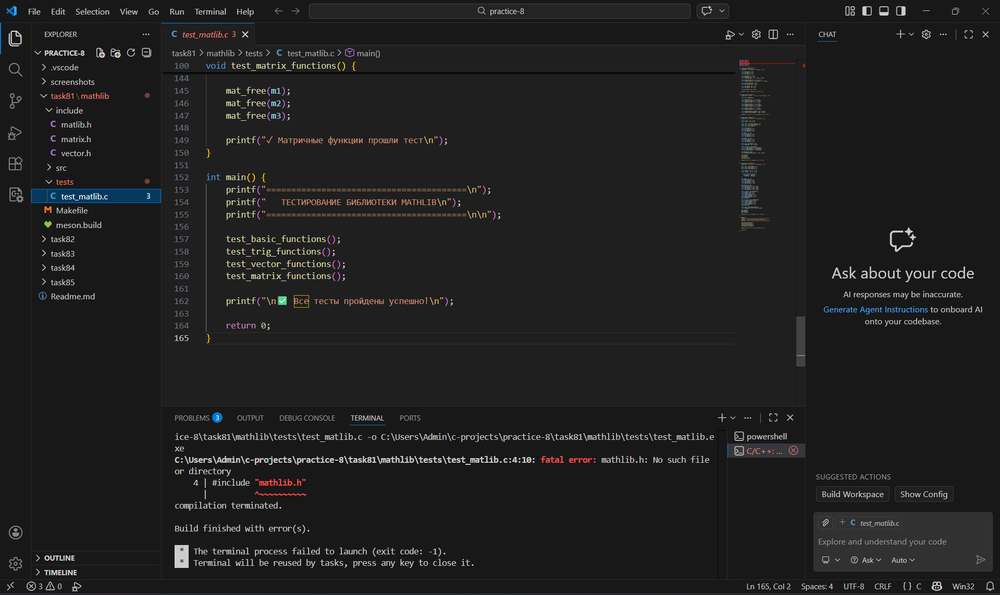
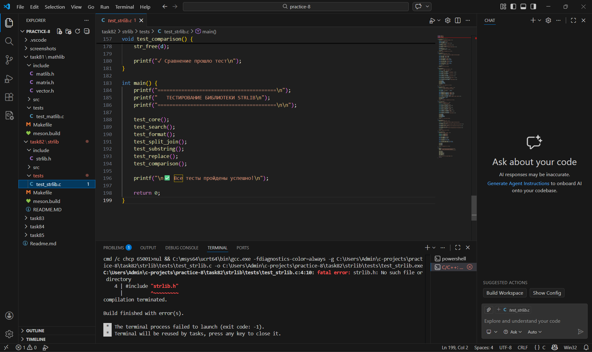
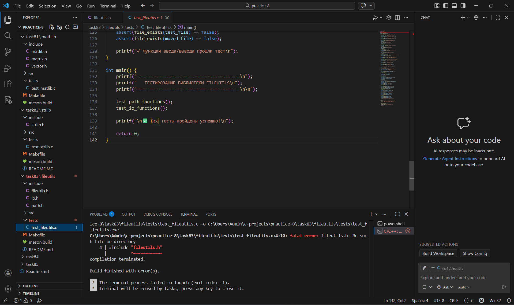
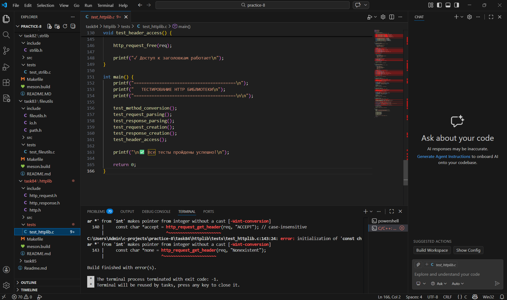
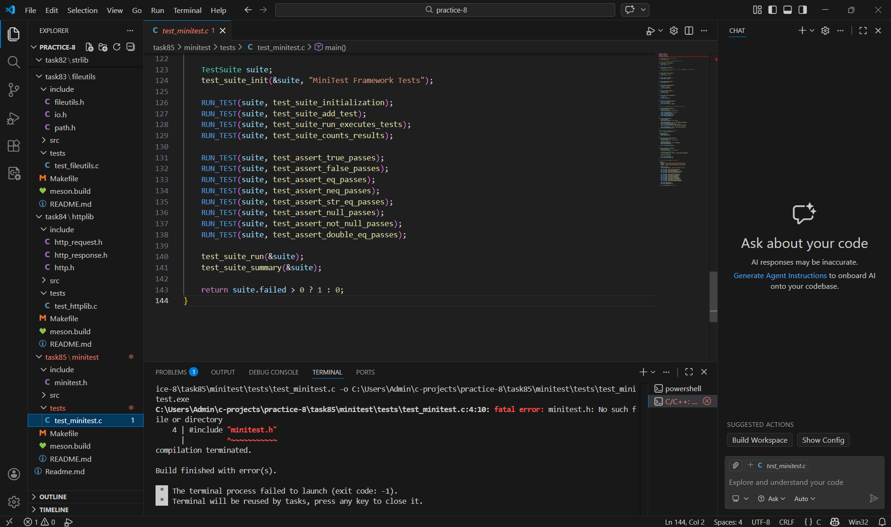

Практическая работа 8: Многофайловые проекты
Студент: Карасев Арсений Алексеевич
Группа: 1зб_ИВТ-25
Дата: 21 февраля 2026 г.

Задание 8.1: Математическая библиотека (MathLib)
Постановка задачи
Создайте библиотеку математических функций с базовыми операциями, тригонометрией и преобразованиями, а также функции для работы с векторами и матрицами.

Структура проекта
text
mathlib/
├── include/
│   ├── mathlib.h        # Основной заголовок с математическими функциями
│   ├── vector.h          # Операции с векторами
│   └── matrix.h          # Операции с матрицами
├── src/
│   ├── main.c            # Демонстрационная программа
│   ├── basic.c           # Базовые математические функции
│   ├── vector.c          # Реализация векторных операций
│   └── matrix.c          # Реализация матричных операций
├── tests/
│   └── test_mathlib.c    # Тесты
├── Makefile              # Сборка через GNU Make
├── meson.build           # Сборка через Meson
└── README.md             # Документация
Include guards
c
#ifndef MATHLIB_H
#define MATHLIB_H
// объявления
#endif // MATHLIB_H
Основные функции
mathlib.h:

#ifndef MATHLIB_H
#define MATHLIB_H

// Константы
#define MATHLIB_PI 3.14159265358979323846
#define MATHLIB_E 2.71828182845904523536

// Базовые функции
double ml_abs(double x);
double ml_pow(double base, int exp);
double ml_sqrt(double x);
double ml_factorial(int n);
int ml_gcd(int a, int b);
int ml_lcm(int a, int b);

// Тригонометрия (в радианах)
double ml_sin(double x);
double ml_cos(double x);
double ml_tan(double x);

// Преобразования
double ml_deg_to_rad(double degrees);
double ml_rad_to_deg(double radians);

#endif // MATHLIB_H

vector.h:

#ifndef VECTOR_H
#define VECTOR_H

#include <stddef.h>

typedef struct {
    double *data;
    size_t size;
} Vector;

// Создание и уничтожение
Vector* vec_create(size_t size);
Vector* vec_from_array(const double *arr, size_t size);
void vec_free(Vector *v);
Vector* vec_copy(const Vector *v);

// Операции
int vec_add(Vector *result, const Vector *a, const Vector *b);
int vec_sub(Vector *result, const Vector *a, const Vector *b);
void vec_scale(Vector *v, double scalar);
double vec_dot(const Vector *a, const Vector *b);
double vec_norm(const Vector *v);
int vec_normalize(Vector *v);

// Вывод
void vec_print(const Vector *v);

#endif // VECTOR_H

matrix.h:

#ifndef MATRIX_H
#define MATRIX_H

#include <stddef.h>

typedef struct {
    double *data;
    size_t rows;
    size_t cols;
} Matrix;

// Создание и уничтожение
Matrix* mat_create(size_t rows, size_t cols);
Matrix* mat_identity(size_t n);
void mat_free(Matrix *m);
Matrix* mat_copy(const Matrix *m);

// Доступ
double mat_get(const Matrix *m, size_t row, size_t col);
void mat_set(Matrix *m, size_t row, size_t col, double value);

// Операции
int mat_add(Matrix *result, const Matrix *a, const Matrix *b);
int mat_sub(Matrix *result, const Matrix *a, const Matrix *b);
int mat_mul(Matrix *result, const Matrix *a, const Matrix *b);
void mat_scale(Matrix *m, double scalar);
Matrix* mat_transpose(const Matrix *m);
double mat_determinant(const Matrix *m);
Matrix* mat_inverse(const Matrix *m);

// Вывод
void mat_print(const Matrix *m);

#endif // MATRIX_H
Реализация (фрагменты)

basic.c:

#include "mathlib.h"
#include <stdio.h>

double ml_abs(double x) {
    return x < 0 ? -x : x;
}

double ml_pow(double base, int exp) {
    if (exp == 0) return 1.0;
    
    double result = 1.0;
    int positive_exp = exp > 0 ? exp : -exp;
    
    for (int i = 0; i < positive_exp; i++) {
        result *= base;
    }
    
    return exp > 0 ? result : 1.0 / result;
}

double ml_sqrt(double x) {
    if (x < 0) {
        printf("Ошибка: sqrt от отрицательного числа %.2f\n", x);
        return 0;
    }
    if (x == 0) return 0;
    
    // Метод Ньютона
    double guess = x / 2.0;
    double prev;
    
    do {
        prev = guess;
        guess = (guess + x / guess) / 2.0;
    } while (ml_abs(guess - prev) > 1e-10);
    
    return guess;
}

vector.c:

#include "vector.h"
#include <stdio.h>
#include <stdlib.h>
#include <string.h>
#include <math.h>

Vector* vec_create(size_t size) {
    Vector *v = (Vector*)malloc(sizeof(Vector));
    if (!v) return NULL;
    
    v->size = size;
    v->data = (double*)calloc(size, sizeof(double));
    
    if (!v->data) {
        free(v);
        return NULL;
    }
    
    return v;
}

int vec_add(Vector *result, const Vector *a, const Vector *b) {
    if (!result || !a || !b) return -1;
    if (result->size != a->size || a->size != b->size) return -1;
    
    for (size_t i = 0; i < a->size; i++) {
        result->data[i] = a->data[i] + b->data[i];
    }
    
    return 0;
}

matrix.c:

#include "matrix.h"
#include <stdio.h>
#include <stdlib.h>
#include <string.h>
#include <math.h>

Matrix* mat_create(size_t rows, size_t cols) {
    Matrix *m = (Matrix*)malloc(sizeof(Matrix));
    if (!m) return NULL;
    
    m->rows = rows;
    m->cols = cols;
    m->data = (double*)calloc(rows * cols, sizeof(double));
    
    if (!m->data) {
        free(m);
        return NULL;
    }
    
    return m;
}

int mat_mul(Matrix *result, const Matrix *a, const Matrix *b) {
    if (!result || !a || !b) return -1;
    if (a->cols != b->rows) return -1;
    if (result->rows != a->rows || result->cols != b->cols) return -1;
    
    for (size_t i = 0; i < a->rows; i++) {
        for (size_t j = 0; j < b->cols; j++) {
            double sum = 0;
            for (size_t k = 0; k < a->cols; k++) {
                sum += a->data[i * a->cols + k] * b->data[k * b->cols + j];
            }
            result->data[i * result->cols + j] = sum;
        }
    }
    
    return 0;
}
Makefile
makefile
CC = gcc
CFLAGS = -Wall -Wextra -Wpedantic -std=c11 -I include
CFLAGS_DEBUG = -g -O0
CFLAGS_RELEASE = -O2 -DNDEBUG
LDFLAGS = -lm

SRC_DIR = src
OBJ_DIR = obj
BIN_DIR = bin

SRCS = $(wildcard $(SRC_DIR)/*.c)
OBJS = $(patsubst $(SRC_DIR)/%.c,$(OBJ_DIR)/%.o,$(SRCS))
LIB_OBJS = $(filter-out $(OBJ_DIR)/main.o,$(OBJS))
TARGET = $(BIN_DIR)/mathlib_demo
LIB = $(BIN_DIR)/libmathlib.a

.PHONY: all clean lib demo test

all: lib demo

lib: $(LIB)

demo: $(TARGET)

$(LIB): $(LIB_OBJS) | $(BIN_DIR)
	ar rcs $@ $^

$(TARGET): $(OBJ_DIR)/main.o $(LIB) | $(BIN_DIR)
	$(CC) $< -L$(BIN_DIR) -lmathlib $(LDFLAGS) -o $@

$(OBJ_DIR)/%.o: $(SRC_DIR)/%.c | $(OBJ_DIR)
	$(CC) $(CFLAGS) $(CFLAGS_DEBUG) -c $< -o $@

$(BIN_DIR) $(OBJ_DIR):
	mkdir -p $@

test: $(BIN_DIR)/test_mathlib
	./$(BIN_DIR)/test_mathlib

$(BIN_DIR)/test_mathlib: tests/test_mathlib.c $(LIB) | $(BIN_DIR)
	$(CC) $(CFLAGS) $< -L$(BIN_DIR) -lmathlib $(LDFLAGS) -o $@

clean:
	rm -rf $(OBJ_DIR) $(BIN_DIR)
Тесты
c
#include <stdio.h>
#include <assert.h>
#include <math.h>
#include "mathlib.h"
#include "vector.h"
#include "matrix.h"

void test_basic_functions() {
    printf("Тестирование базовых функций...\n");
    
    assert(ml_abs(5) == 5);
    assert(ml_abs(-5) == 5);
    assert(ml_abs(0) == 0);
    
    assert(ml_pow(2, 3) == 8);
    assert(ml_pow(2, 0) == 1);
    assert(fabs(ml_pow(2, -3) - 0.125) < 1e-10);
    
    assert(fabs(ml_sqrt(16) - 4) < 1e-10);
    assert(fabs(ml_sqrt(2) * ml_sqrt(2) - 2) < 1e-10);
    
    printf("✓ Базовые функции прошли тест\n");
}

Результаты работы

Задание 8.2: Библиотека для работы со строками (StrLib)
Постановка задачи
Создайте библиотеку для работы с динамическими строками: создание, модификация, поиск, форматирование, сравнение.

Структура проекта
text
strlib/
├── include/
│   └── strlib.h          # Основной заголовок
├── src/
│   ├── main.c             # Демонстрационная программа
│   ├── strlib_core.c      # Базовые операции
│   ├── strlib_search.c    # Поиск
│   └── strlib_format.c    # Форматирование
├── tests/
│   └── test_strlib.c      # Тесты
├── Makefile
├── meson.build
└── README.md
Структура данных

typedef struct {
    char *data;
    size_t length;
    size_t capacity;
} String;
Основные функции
strlib.h:

#ifndef STRLIB_H
#define STRLIB_H

#include <stddef.h>
#include <stdbool.h>

typedef struct {
    char *data;
    size_t length;
    size_t capacity;
} String;

// === Core ===
String* str_new(const char *init);
String* str_new_capacity(size_t capacity);
void str_free(String *s);
String* str_copy(const String *s);
size_t str_length(const String *s);
const char* str_cstr(const String *s);
bool str_empty(const String *s);
void str_clear(String *s);

// === Modification ===
void str_append(String *s, const char *text);
void str_append_char(String *s, char c);
void str_prepend(String *s, const char *text);
void str_insert(String *s, size_t pos, const char *text);
void str_erase(String *s, size_t pos, size_t len);
void str_replace(String *s, const char *old, const char *new_str);

// === Search ===
int str_find(const String *s, const char *substr);
int str_find_last(const String *s, const char *substr);
int str_find_char(const String *s, char c);
bool str_contains(const String *s, const char *substr);
bool str_starts_with(const String *s, const char *prefix);
bool str_ends_with(const String *s, const char *suffix);
size_t str_count(const String *s, const char *substr);

// === Format ===
String* str_to_upper(const String *s);
String* str_to_lower(const String *s);
String* str_trim(const String *s);
String* str_trim_left(const String *s);
String* str_trim_right(const String *s);
String** str_split(const String *s, char delimiter, size_t *count);
String* str_join(String **parts, size_t count, const char *separator);
String* str_substring(const String *s, size_t start, size_t len);
String* str_repeat(const char *text, size_t times);
String* str_reverse(const String *s);

// === Comparison ===
int str_compare(const String *a, const String *b);
bool str_equals(const String *a, const String *b);
bool str_equals_ignore_case(const String *a, const String *b);

// === Utility ===
void str_free_array(String **arr, size_t count);

#endif // STRLIB_H
Реализация (фрагменты)
strlib_core.c:

#include "strlib.h"
#include <stdio.h>
#include <stdlib.h>
#include <string.h>

static void ensure_capacity(String *s, size_t additional) {
    if (s->length + additional + 1 > s->capacity) {
        s->capacity = s->length + additional + 1;
        if (s->capacity < 16) s->capacity = 16;
        s->data = (char*)realloc(s->data, s->capacity);
    }
}

String* str_new(const char *init) {
    String *s = (String*)malloc(sizeof(String));
    if (!s) return NULL;
    
    if (init) {
        s->length = strlen(init);
        s->capacity = s->length + 1;
        s->data = (char*)malloc(s->capacity);
        if (!s->data) {
            free(s);
            return NULL;
        }
        strcpy(s->data, init);
    } else {
        s->length = 0;
        s->capacity = 16;
        s->data = (char*)malloc(s->capacity);
        if (!s->data) {
            free(s);
            return NULL;
        }
        s->data[0] = '\0';
    }
    
    return s;
}

void str_append(String *s, const char *text) {
    if (!s || !text) return;
    
    size_t text_len = strlen(text);
    ensure_capacity(s, text_len);
    
    strcpy(s->data + s->length, text);
    s->length += text_len;
}
strlib_search.c:

#include "strlib.h"
#include <string.h>

int str_find(const String *s, const char *substr) {
    if (!s || !substr) return -1;
    
    const char *pos = strstr(s->data, substr);
    if (pos) {
        return pos - s->data;
    }
    return -1;
}

bool str_starts_with(const String *s, const char *prefix) {
    if (!s || !prefix) return false;
    
    size_t prefix_len = strlen(prefix);
    if (prefix_len > s->length) return false;
    
    return strncmp(s->data, prefix, prefix_len) == 0;
}

Результаты работы

Задание 8.3: Утилиты для работы с файлами (FileUtils)
Постановка задачи
Создайте библиотеку файловых утилит: манипуляции с путями, чтение/запись файлов, копирование, перемещение и удаление.

Структура проекта

fileutils/
├── include/
│   ├── fileutils.h        # Основной заголовок
│   ├── path.h              # Функции для работы с путями
│   └── io.h                # Функции ввода/вывода
├── src/
│   ├── main.c              # Демонстрационная программа
│   ├── path.c              # Реализация функций путей
│   └── io.c                # Реализация функций ввода/вывода
├── tests/
│   └── test_fileutils.c    # Тесты
├── Makefile
├── meson.build
└── README.md
Заголовочные файлы

path.h:

#ifndef PATH_H
#define PATH_H

#include <stdbool.h>
#include <stddef.h>

#ifdef _WIN32
#define PATH_SEP '\\'
#define PATH_SEP_STR "\\"
#else
#define PATH_SEP '/'
#define PATH_SEP_STR "/"
#endif

char* path_join(const char *base, const char *name);
char* path_dirname(const char *path);
char* path_basename(const char *path);
char* path_extension(const char *path);
char* path_without_extension(const char *path);
char* path_normalize(const char *path);
bool path_is_absolute(const char *path);
bool path_exists(const char *path);
bool path_is_file(const char *path);
bool path_is_directory(const char *path);

#endif // PATH_H

io.h:

#ifndef IO_H
#define IO_H

#include <stddef.h>
#include <stdbool.h>

char* file_read_all(const char *filename, size_t *size);
int file_write_all(const char *filename, const char *content);
int file_append(const char *filename, const char *content);
char** file_read_lines(const char *filename, size_t *count);
void file_free_lines(char **lines, size_t count);
int file_copy(const char *src, const char *dst);
int file_move(const char *src, const char *dst);
int file_delete(const char *path);
long file_size(const char *filename);
bool file_exists(const char *filename);

#endif // IO_H
Реализация (фрагменты)

path.c:

#include "path.h"
#include <stdio.h>
#include <stdlib.h>
#include <string.h>
#include <sys/stat.h>

char* path_join(const char *base, const char *name) {
    if (!base && !name) return NULL;
    if (!base) return strdup(name);
    if (!name) return strdup(base);
    
    size_t base_len = strlen(base);
    size_t name_len = strlen(name);
    
    // Убираем завершающий разделитель в base
    while (base_len > 0 && base[base_len - 1] == PATH_SEP) {
        base_len--;
    }
    
    // Убираем начальный разделитель в name
    size_t name_start = 0;
    while (name_start < name_len && name[name_start] == PATH_SEP) {
        name_start++;
    }
    
    size_t result_len = base_len + 1 + (name_len - name_start) + 1;
    char *result = (char*)malloc(result_len);
    
    if (result) {
        if (base_len > 0) {
            memcpy(result, base, base_len);
        }
        result[base_len] = PATH_SEP;
        
        if (name_len - name_start > 0) {
            memcpy(result + base_len + 1, name + name_start, name_len - name_start);
        }
        
        result[base_len + 1 + (name_len - name_start)] = '\0';
    }
    
    return result;
}

char* path_dirname(const char *path) {
    if (!path || *path == '\0') return strdup(".");
    
    const char *last_sep = NULL;
    for (const char *p = path; *p; p++) {
        if (*p == '/' || *p == '\\') {
            last_sep = p;
        }
    }
    
    if (!last_sep) return strdup(".");
    if (last_sep == path) return strdup(PATH_SEP_STR);
    
    size_t len = last_sep - path;
    char *result = (char*)malloc(len + 1);
    if (result) {
        memcpy(result, path, len);
        result[len] = '\0';
    }
    
    return result;
}

io.c:

#include "io.h"
#include <stdio.h>
#include <stdlib.h>
#include <string.h>

#ifdef _WIN32
#include <io.h>
#define F_OK 0
#else
#include <unistd.h>
#endif

char* file_read_all(const char *filename, size_t *size) {
    FILE *file = fopen(filename, "rb");
    if (!file) {
        if (size) *size = 0;
        return NULL;
    }
    
    fseek(file, 0, SEEK_END);
    long file_size = ftell(file);
    fseek(file, 0, SEEK_SET);
    
    if (file_size < 0) {
        fclose(file);
        if (size) *size = 0;
        return NULL;
    }
    
    char *buffer = (char*)malloc(file_size + 1);
    if (!buffer) {
        fclose(file);
        if (size) *size = 0;
        return NULL;
    }
    
    size_t bytes_read = fread(buffer, 1, file_size, file);
    buffer[bytes_read] = '\0';
    
    fclose(file);
    
    if (size) *size = bytes_read;
    return buffer;
}

int file_copy(const char *src, const char *dst) {
    FILE *src_file = fopen(src, "rb");
    if (!src_file) return -1;
    
    FILE *dst_file = fopen(dst, "wb");
    if (!dst_file) {
        fclose(src_file);
        return -1;
    }
    
    char buffer[8192];
    size_t bytes_read;
    
    while ((bytes_read = fread(buffer, 1, sizeof(buffer), src_file)) > 0) {
        if (fwrite(buffer, 1, bytes_read, dst_file) != bytes_read) {
            fclose(src_file);
            fclose(dst_file);
            return -1;
        }
    }
    
    fclose(src_file);
    fclose(dst_file);
    return 0;
}

Результаты работы

Задание 8.4: Простой HTTP-парсер (HTTPLib)
Постановка задачи
Создайте библиотеку для парсинга HTTP запросов и ответов.

Структура проекта

httplib/
├── include/
│   ├── http.h              # Основной заголовок
│   ├── http_request.h      # Запросы
│   └── http_response.h     # Ответы
├── src/
│   ├── main.c              # Демонстрационная программа
│   ├── http_request.c      # Реализация запросов
│   └── http_response.c     # Реализация ответов
├── tests/
│   └── test_httplib.c      # Тесты
├── Makefile
├── meson.build
└── README.md
Заголовочные файлы

http_request.h:

#ifndef HTTP_REQUEST_H
#define HTTP_REQUEST_H

#include <stddef.h>

typedef enum {
    HTTP_GET, HTTP_POST, HTTP_PUT, HTTP_DELETE,
    HTTP_HEAD, HTTP_OPTIONS, HTTP_UNKNOWN
} HttpMethod;

typedef struct {
    char name[64];
    char value[256];
} HttpHeader;

typedef struct {
    HttpMethod method;
    char path[256];
    char version[16];
    HttpHeader headers[50];
    int header_count;
    char *body;
    size_t body_length;
} HttpRequest;

HttpRequest* http_request_parse(const char *raw);
void http_request_free(HttpRequest *req);
HttpRequest* http_request_create(HttpMethod method, const char *path);
void http_request_add_header(HttpRequest *req, const char *name, const char *value);
void http_request_set_body(HttpRequest *req, const char *body);
char* http_request_to_string(const HttpRequest *req);
const char* http_method_to_string(HttpMethod method);
HttpMethod http_method_from_string(const char *str);
const char* http_request_get_header(const HttpRequest *req, const char *name);

#endif // HTTP_REQUEST_H

http_response.h:

#ifndef HTTP_RESPONSE_H
#define HTTP_RESPONSE_H

#include <stddef.h>

typedef struct {
    char version[16];
    int status_code;
    char status_text[64];
    HttpHeader headers[50];
    int header_count;
    char *body;
    size_t body_length;
} HttpResponse;

HttpResponse* http_response_parse(const char *raw);
void http_response_free(HttpResponse *resp);
HttpResponse* http_response_create(int status_code, const char *status_text);
void http_response_add_header(HttpResponse *resp, const char *name, const char *value);
void http_response_set_body(HttpResponse *resp, const char *body);
char* http_response_to_string(const HttpResponse *resp);
const char* http_response_get_header(const HttpResponse *resp, const char *name);
const char* http_status_text(int status_code);

#endif // HTTP_RESPONSE_H

Реализация (фрагменты)
http_request.c:

#include "http_request.h"
#include <stdio.h>
#include <stdlib.h>
#include <string.h>
#include <ctype.h>

static char* trim_whitespace(char *str) {
    if (!str) return NULL;
    
    while (isspace((unsigned char)*str)) str++;
    if (*str == 0) return str;
    
    char *end = str + strlen(str) - 1;
    while (end > str && isspace((unsigned char)*end)) end--;
    end[1] = '\0';
    
    return str;
}

HttpRequest* http_request_parse(const char *raw) {
    if (!raw) return NULL;
    
    HttpRequest *req = (HttpRequest*)calloc(1, sizeof(HttpRequest));
    if (!req) return NULL;
    
    char *raw_copy = strdup(raw);
    if (!raw_copy) {
        free(req);
        return NULL;
    }
    
    char *line = strtok(raw_copy, "\r\n");
    if (!line) {
        free(raw_copy);
        free(req);
        return NULL;
    }
    
    char method_str[16] = {0};
    char path[256] = {0};
    char version[16] = {0};
    
    int parsed = sscanf(line, "%15s %255s %15s", method_str, path, version);
    if (parsed >= 2) {
        req->method = http_method_from_string(method_str);
        strncpy(req->path, path, sizeof(req->path) - 1);
        
        if (parsed == 3) {
            strncpy(req->version, version, sizeof(req->version) - 1);
        } else {
            strcpy(req->version, "HTTP/0.9");
        }
    }
    
    // Парсинг заголовков...
    
    return req;
}

Результаты работы

Задание 8.5: Мини-тестовый фреймворк (MiniTest)
Постановка задачи
Создайте простой фреймворк для модульного тестирования с макросами утверждений.

Структура проекта

minitest/
├── include/
│   └── minitest.h         # Основной заголовок
├── src/
│   └── main.c             # Демонстрация использования
├── tests/
│   └── test_minitest.c    # Тесты самого фреймворка
├── Makefile
├── meson.build
└── README.md
Заголовочный файл

minitest.h:

#ifndef MINITEST_H
#define MINITEST_H

#include <stdio.h>
#include <string.h>
#include <math.h>
#include <stdlib.h>

typedef void (*TestFunc)(void);

typedef struct {
    const char *name;
    TestFunc func;
} TestCase;

typedef struct {
    const char *name;
    TestCase *tests;
    int test_count;
    int passed;
    int failed;
} TestSuite;

extern int _test_failed;

#define ASSERT_TRUE(cond) \
    do { \
        if (!(cond)) { \
            printf("  ❌ FAILED: %s:%d: %s\n", __FILE__, __LINE__, #cond); \
            _test_failed = 1; \
            return; \
        } \
    } while(0)

#define ASSERT_FALSE(cond) ASSERT_TRUE(!(cond))

#define ASSERT_EQ(a, b) \
    do { \
        if ((a) != (b)) { \
            printf("  ❌ FAILED: %s:%d: %s != %s (%d != %d)\n", \
                   __FILE__, __LINE__, #a, #b, (int)(a), (int)(b)); \
            _test_failed = 1; \
            return; \
        } \
    } while(0)

#define ASSERT_STR_EQ(a, b) \
    do { \
        if (strcmp((a), (b)) != 0) { \
            printf("  ❌ FAILED: %s:%d: \"%s\" != \"%s\"\n", \
                   __FILE__, __LINE__, (a), (b)); \
            _test_failed = 1; \
            return; \
        } \
    } while(0)

#define ASSERT_DOUBLE_EQ(a, b, eps) \
    do { \
        double _diff = (a) - (b); \
        if (_diff < 0) _diff = -_diff; \
        if (_diff > (eps)) { \
            printf("  ❌ FAILED: %s:%d: %f != %f (eps=%f)\n", \
                   __FILE__, __LINE__, (double)(a), (double)(b), (eps)); \
            _test_failed = 1; \
            return; \
        } \
    } while(0)

// Функции управления тестами
void test_suite_init(TestSuite *suite, const char *name);
void test_suite_add(TestSuite *suite, const char *name, TestFunc func);
void test_suite_run(TestSuite *suite);
void test_suite_summary(const TestSuite *suite);

#define RUN_TEST(suite, test_func) \
    test_suite_add(&suite, #test_func, test_func)

#endif // MINITEST_H
Реализация функций управления
c
void test_suite_init(TestSuite *suite, const char *name) {
    suite->name = name;
    suite->tests = NULL;
    suite->test_count = 0;
    suite->passed = 0;
    suite->failed = 0;
}

void test_suite_add(TestSuite *suite, const char *name, TestFunc func) {
    if (suite->test_count == 0) {
        suite->tests = (TestCase*)malloc(sizeof(TestCase));
    } else {
        suite->tests = (TestCase*)realloc(suite->tests, 
                                          (suite->test_count + 1) * sizeof(TestCase));
    }
    
    suite->tests[suite->test_count].name = name;
    suite->tests[suite->test_count].func = func;
    suite->test_count++;
}

void test_suite_run(TestSuite *suite) {
    printf("\n🔍 Запуск тестов: %s\n", suite->name);
    printf("========================================\n");
    
    suite->passed = 0;
    suite->failed = 0;
    
    for (int i = 0; i < suite->test_count; i++) {
        TestCase *test = &suite->tests[i];
        printf("\n📋 Тест #%d: %s\n", i + 1, test->name);
        printf("  ");
        
        _test_failed = 0;
        test->func();
        
        if (_test_failed) {
            printf("  ❌ ТЕСТ ПРОВАЛЕН\n");
            suite->failed++;
        } else {
            printf("  ✅ ТЕСТ ПРОЙДЕН\n");
            suite->passed++;
        }
    }
}

void test_suite_summary(const TestSuite *suite) {
    printf("\n========================================\n");
    printf("📊 РЕЗУЛЬТАТЫ ТЕСТОВ: %s\n", suite->name);
    printf("  Всего тестов: %d\n", suite->test_count);
    printf("  ✅ Пройдено:   %d\n", suite->passed);
    printf("  ❌ Провалено:  %d\n", suite->failed);
    printf("========================================\n");
}
Пример использования
c
#include "minitest.h"

int _test_failed = 0;

int add(int a, int b) {
    return a + b;
}

void test_add_positive() {
    ASSERT_EQ(add(2, 3), 5);
}

void test_add_negative() {
    ASSERT_EQ(add(-2, -3), -5);
}

int main() {
    TestSuite suite;
    test_suite_init(&suite, "Math Tests");
    
    RUN_TEST(suite, test_add_positive);
    RUN_TEST(suite, test_add_negative);
    
    test_suite_run(&suite);
    test_suite_summary(&suite);
    
    return 0;
}

Результаты работы

