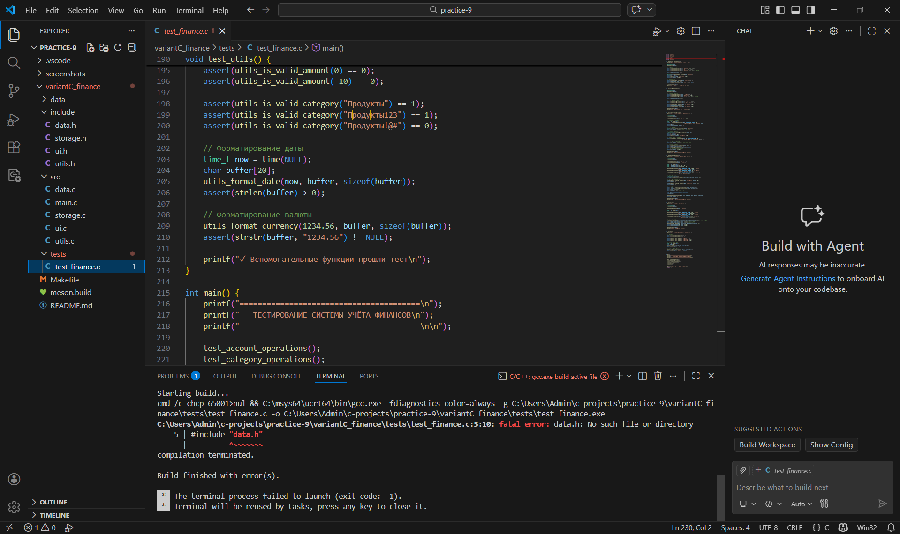

Практическая работа 9: Итоговый проект
Система учёта финансов (Вариант C)
Студент: Карасев Арсений Алексеевич
Группа: 1зб_ИВТ-25
Дата: 21 февраля 2026 г.

Описание проекта
Система учёта финансов — консольное приложение для учёта доходов и расходов с возможностью ведения нескольких счетов, категоризации транзакций и формирования отчётов.

Функциональность
✅ Управление несколькими счетами

✅ Категоризация транзакций

✅ Добавление, редактирование, удаление транзакций

✅ Фильтрация и сортировка транзакций

✅ Статистика за период

✅ Отчёты по категориям

✅ Экспорт в CSV

✅ Сохранение данных в бинарном файле

Структура проекта

variantC_finance/
├── include/
│   ├── data.h          # Структуры данных и операции с ними
│   ├── storage.h       # Работа с файлами (сохранение/загрузка)
│   ├── ui.h            # Пользовательский интерфейс
│   └── utils.h         # Вспомогательные функции
├── src/
│   ├── main.c          # Точка входа
│   ├── data.c          # Реализация структур данных
│   ├── storage.c       # Реализация файловых операций
│   ├── ui.c            # Реализация интерфейса
│   └── utils.c         # Реализация утилит
├── tests/
│   └── test_finance.c  # Модульные тесты
├── data/               # Директория для файлов данных (создаётся автоматически)
├── Makefile
├── meson.build
└── README.md

Include guards
Все заголовочные файлы используют include guards для предотвращения множественного включения:

c
#ifndef DATA_H
#define DATA_H

// объявления

#endif // DATA_H
Реализация
Модуль data
data.h — содержит определения структур данных и прототипы функций для работы с ними.

Структуры данных
c
// Типы транзакций
typedef enum {
    TRANSACTION_INCOME,
    TRANSACTION_EXPENSE
} TransactionType;

// Структура транзакции
typedef struct {
    int id;
    TransactionType type;
    double amount;
    char category[MAX_CATEGORY_NAME];
    char description[MAX_DESCRIPTION];
    time_t date;
    char account[MAX_ACCOUNT_NAME];
} Transaction;

// Структура счёта
typedef struct {
    char name[MAX_ACCOUNT_NAME];
    double balance;
} Account;

// Основная структура данных
typedef struct {
    Transaction *transactions;
    int transaction_count;
    int transaction_capacity;
    int next_transaction_id;
    
    Account accounts[MAX_ACCOUNTS];
    int account_count;
    
    char categories[MAX_CATEGORIES][MAX_CATEGORY_NAME];
    int category_count;
} FinanceData;
Основные функции
Функция	Описание
finance_init	Инициализация структуры данных
finance_cleanup	Очистка памяти
finance_add_account	Добавление нового счёта
finance_remove_account	Удаление счёта
finance_add_category	Добавление категории
finance_add_transaction	Добавление транзакции
finance_edit_transaction	Редактирование транзакции
finance_delete_transaction	Удаление транзакции
finance_filter_by_date	Фильтрация по дате
finance_get_category_stats	Статистика по категориям
Фрагмент реализации (data.c):

c
int finance_add_transaction(FinanceData *data, TransactionType type,
                           double amount, const char *category,
                           const char *description, const char *account,
                           time_t date) {
    if (!data || !category || !description || !account) return -1;
    if (amount <= 0) return -2;
    
    // Проверяем существование счёта
    Account *acc = finance_find_account(data, account);
    if (!acc) return -3;
    
    // Расширяем массив при необходимости
    if (data->transaction_count >= data->transaction_capacity) {
        int new_capacity = data->transaction_capacity == 0 ? 10 : data->transaction_capacity * 2;
        Transaction *new_trans = realloc(data->transactions, new_capacity * sizeof(Transaction));
        if (!new_trans) return -5;
        
        data->transactions = new_trans;
        data->transaction_capacity = new_capacity;
    }
    
    // Создаём транзакцию
    Transaction *t = &data->transactions[data->transaction_count];
    t->id = data->next_transaction_id++;
    t->type = type;
    t->amount = amount;
    utils_safe_strcpy(t->category, category, MAX_CATEGORY_NAME);
    utils_safe_strcpy(t->description, description, MAX_DESCRIPTION);
    utils_safe_strcpy(t->account, account, MAX_ACCOUNT_NAME);
    t->date = date;
    
    // Обновляем баланс счёта
    if (type == TRANSACTION_INCOME) {
        acc->balance += amount;
    } else {
        acc->balance -= amount;
    }
    
    data->transaction_count++;
    return t->id;
}
Модуль storage
storage.h — обеспечивает сохранение и загрузку данных в бинарный файл, а также экспорт в CSV.

Основные функции
Функция	Описание
storage_save	Сохранение данных в файл
storage_load	Загрузка данных из файла
storage_export_csv	Экспорт транзакций за период в CSV
storage_ensure_data_dir	Создание директории для данных

Фрагмент реализации (storage.c):

int storage_save(const FinanceData *data, const char *filename) {
    if (!data || !filename) return -1;
    
    // Создаём директорию для данных
    storage_ensure_data_dir();
    
    // Формируем полный путь
    char fullpath[512];
    snprintf(fullpath, sizeof(fullpath), "%s/%s", storage_get_data_dir(), filename);
    
    FILE *file = fopen(fullpath, "wb");
    if (!file) return -2;
    
    // Сохраняем количество счетов и сами счета
    fwrite(&data->account_count, sizeof(int), 1, file);
    fwrite(data->accounts, sizeof(Account), data->account_count, file);
    
    // Сохраняем количество категорий
    fwrite(&data->category_count, sizeof(int), 1, file);
    for (int i = 0; i < data->category_count; i++) {
        fwrite(data->categories[i], MAX_CATEGORY_NAME, 1, file);
    }
    
    // Сохраняем транзакции
    fwrite(&data->transaction_count, sizeof(int), 1, file);
    fwrite(&data->next_transaction_id, sizeof(int), 1, file);
    fwrite(data->transactions, sizeof(Transaction), data->transaction_count, file);
    
    fclose(file);
    return 0;
}
Модуль ui
ui.h — реализует консольный пользовательский интерфейс с меню и формами ввода.

Основные функции
Функция	Описание
ui_main_loop	Главный цикл обработки команд
ui_show_main_menu	Отображение главного меню
ui_read_int	Ввод целого числа с проверкой
ui_read_double	Ввод вещественного числа
ui_read_date	Ввод даты
ui_show_transactions	Отображение списка транзакций
ui_show_stats	Отображение статистики
Фрагмент реализации (ui.c):

c
void ui_show_stats(const FinanceData *data) {
    time_t now = time(NULL);
    struct tm *tm_now = localtime(&now);
    
    // Начало текущего месяца
    struct tm tm_month_start = *tm_now;
    tm_month_start.tm_mday = 1;
    tm_month_start.tm_hour = 0;
    tm_month_start.tm_min = 0;
    tm_month_start.tm_sec = 0;
    time_t month_start = mktime(&tm_month_start);
    
    double total_balance = finance_get_balance(data);
    double month_income = finance_get_income_total(data, month_start, now);
    double month_expense = finance_get_expense_total(data, month_start, now);
    
    printf("\n=== СТАТИСТИКА ===\n\n");
    printf("Общий баланс: %.2f ₽\n\n", total_balance);
    
    printf("Текущий месяц:\n");
    printf("  Доходы:  +%.2f ₽\n", month_income);
    printf("  Расходы: -%.2f ₽\n", month_expense);
    printf("  Итого:   %+.2f ₽\n", month_income - month_expense);
    
    // Статистика по категориям за текущий месяц
    if (month_expense > 0) {
        char cats[MAX_CATEGORIES][MAX_CATEGORY_NAME];
        double amounts[MAX_CATEGORIES];
        int cat_count;
        
        finance_get_category_stats(data, month_start, now, cats, amounts, &cat_count);
        
        if (cat_count > 0) {
            printf("\nРасходы по категориям (текущий месяц):\n");
            for (int i = 0; i < cat_count; i++) {
                double percent = (amounts[i] / month_expense) * 100;
                printf("  %-15s %10.2f ₽ (%5.1f%%)\n", 
                       cats[i], amounts[i], percent);
            }
        }
    }
}
Модуль utils
utils.h — содержит вспомогательные функции для работы с датами, валидации данных и форматирования.

Основные функции
Функция	Описание
utils_parse_date	Парсинг даты из строки
utils_format_date	Форматирование даты в строку
utils_format_currency	Форматирование валюты
utils_is_valid_amount	Проверка корректности суммы
utils_is_valid_category	Проверка названия категории

Фрагмент реализации (utils.c):

time_t utils_parse_date(const char *date_str) {
    if (!date_str || strlen(date_str) == 0) {
        return time(NULL);
    }
    
    struct tm tm = {0};
    if (sscanf(date_str, "%d-%d-%d", &tm.tm_year, &tm.tm_mon, &tm.tm_mday) == 3) {
        tm.tm_year -= 1900;
        tm.tm_mon -= 1;
        return mktime(&tm);
    }
    
    return time(NULL);
}

int utils_is_valid_category(const char *category) {
    if (!category || strlen(category) == 0) return 0;
    
    for (int i = 0; category[i]; i++) {
        if (!isalnum(category[i]) && category[i] != ' ' && 
            category[i] != '-' && category[i] != '_') {
            return 0;
        }
    }
    return 1;
}
Главный модуль main
main.c — точка входа в программу, инициализация данных и запуск пользовательского интерфейса.

#include <stdio.h>
#include <stdlib.h>
#include <locale.h>
#include "data.h"
#include "storage.h"
#include "ui.h"
#include "utils.h"

int main(void) {
    // Устанавливаем локаль для корректного отображения русских символов
    setlocale(LC_ALL, "");
    
    FinanceData data;
    finance_init(&data);
    
    // Пытаемся загрузить сохранённые данные
    int load_result = storage_load(&data, "finance.dat");
    
    if (load_result == 0) {
        printf("✅ Данные загружены из finance.dat\n");
    } else if (load_result == -2) {
        printf("ℹ️ Файл данных не найден. Будет создана новая база.\n");
        
        // Добавляем начальные данные для демонстрации
        finance_add_account(&data, "Наличные", 0);
        finance_add_account(&data, "Карта", 0);
        
        finance_add_category(&data, "Продукты");
        finance_add_category(&data, "Транспорт");
        finance_add_category(&data, "Развлечения");
        finance_add_category(&data, "Коммунальные");
        finance_add_category(&data, "Зарплата");
    } else {
        printf("❌ Ошибка при загрузке данных (код %d)\n", load_result);
    }
    
    ui_init();
    ui_main_loop(&data);
    ui_cleanup();
    
    // Финальное сохранение
    storage_save(&data, "finance.dat");
    finance_cleanup(&data);
    
    printf("\n👋 До свидания!\n");
    return 0;
}
Система сборки
Makefile
makefile
CC = gcc
CFLAGS = -Wall -Wextra -Wpedantic -std=c11 -I include
CFLAGS_DEBUG = -g -O0
CFLAGS_RELEASE = -O2 -DNDEBUG
LDFLAGS = -lm

SRC_DIR = src
OBJ_DIR = obj
BIN_DIR = bin
DATA_DIR = data

SRCS = $(wildcard $(SRC_DIR)/*.c)
OBJS = $(patsubst $(SRC_DIR)/%.c,$(OBJ_DIR)/%.o,$(SRCS))
TARGET = $(BIN_DIR)/finance_manager

.PHONY: all clean debug release test data_dir

all: CFLAGS = $(CFLAGS_DEBUG)
all: data_dir $(TARGET)

debug: CFLAGS = $(CFLAGS_DEBUG)
debug: data_dir $(TARGET)

release: CFLAGS = $(CFLAGS_RELEASE)
release: data_dir $(TARGET)

$(TARGET): $(OBJS) | $(BIN_DIR)
	$(CC) $^ $(LDFLAGS) -o $@

$(OBJ_DIR)/%.o: $(SRC_DIR)/%.c | $(OBJ_DIR)
	$(CC) $(CFLAGS) -c $< -o $@

$(BIN_DIR) $(OBJ_DIR):
	mkdir -p $@

data_dir:
	mkdir -p $(DATA_DIR)

test: CFLAGS = $(CFLAGS_DEBUG)
test: $(BIN_DIR)/test_finance
	./$(BIN_DIR)/test_finance

$(BIN_DIR)/test_finance: tests/test_finance.c $(filter-out $(OBJ_DIR)/main.o,$(OBJS)) | $(BIN_DIR)
	$(CC) $(CFLAGS) $^ $(LDFLAGS) -o $@

clean:
	rm -rf $(OBJ_DIR) $(BIN_DIR) $(DATA_DIR)

run: $(TARGET)
	./$(TARGET)

.PHONY: clean run
Цели Makefile:

make или make debug — сборка debug версии

make release — сборка release версии

make test — запуск тестов

make run — запуск программы

make clean — очистка

Meson.build
meson
project('finance_manager', 'c',
  version: '1.0.0',
  default_options: ['warning_level=3', 'c_std=c11', 'buildtype=debugoptimized']
)

inc = include_directories('include')

# Создаём директорию для данных
data_dir = meson.current_source_dir() / 'data'
run_command('mkdir', '-p', data_dir, check: false)

# Исходные файлы
src_files = files(
  'src/main.c',
  'src/data.c',
  'src/storage.c',
  'src/ui.c',
  'src/utils.c'
)

# Исполняемый файл
executable('finance_manager',
  src_files,
  include_directories: inc,
  dependencies: [],
  install: false
)

# Тесты
test_src = files('tests/test_finance.c')
test_exe = executable('test_finance',
  [test_src, src_files],
  include_directories: inc,
  dependencies: []
)

test('finance tests', test_exe)

# Конфигурация для разных типов сборки
if get_option('buildtype') == 'release'
  add_project_arguments('-DNDEBUG', language: 'c')
endif
Команды Meson:

bash
meson setup builddir
meson compile -C builddir
meson test -C builddir

Результат работы

